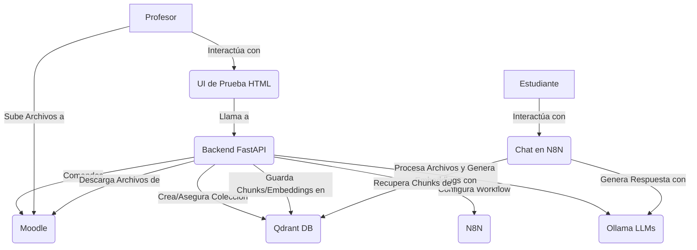

# Entrenai - Sistema Inteligente de Asistencia al Estudiante

Entrenai es un sistema diseñado para proveer asistencia inteligente a estudiantes dentro de cursos específicos de la plataforma Moodle. Utiliza un enfoque de Generación Aumentada por Recuperación (RAG) para analizar el material del curso proporcionado por el profesor y responder preguntas de los estudiantes basadas en dicho material.

El objetivo principal es facilitar el acceso a la información del curso, permitiendo a los estudiantes obtener respuestas relevantes y contextualizadas de manera rápida y eficiente, directamente desde una interfaz de chat integrada en Moodle.

## Características Principales

*   **Integración con Moodle:** Permite a los profesores seleccionar cursos existentes y configurar una IA específica para cada uno. Crea automáticamente los elementos necesarios en Moodle (secciones, carpetas, links).
*   **Procesamiento de Documentos:** Extrae contenido textual de diversos tipos de archivos (PDF, DOCX, PPTX, TXT, MD) subidos por el profesor.
*   **Generación y Almacenamiento de Embeddings:** Divide el contenido extraído en chunks, genera embeddings vectoriales para cada chunk y los almacena en una base de datos vectorial Qdrant.
*   **Modelos de Lenguaje Locales:** Utiliza modelos de lenguaje grandes (LLMs) auto-alojados a través de Ollama para la generación de embeddings, formateo de texto y generación de respuestas.
*   **Chatbot Interactivo:** Proporciona una interfaz de chat (implementada con un workflow de N8N) donde los estudiantes pueden realizar preguntas. El sistema recupera los chunks de información más relevantes de Qdrant y los utiliza junto con un LLM para generar respuestas contextualizadas.
*   **API Backend Robusta:** Una API desarrollada con FastAPI orquesta todas las operaciones, desde la configuración inicial hasta el procesamiento de archivos y la interacción con los diferentes servicios.
*   **Interfaz de Usuario Simple:** Incluye una UI de prueba básica para que los profesores puedan listar sus cursos e iniciar la configuración de la IA.

## Arquitectura General

El sistema Entrenai se compone de los siguientes módulos principales que interactúan entre sí:

1.  **Frontend (UI de Prueba):** Una interfaz web simple (`static/index.html`) que permite al profesor interactuar con la API para configurar la IA para un curso.
2.  **Backend (FastAPI):** El núcleo del sistema, expone una API REST para gestionar la configuración de cursos, el procesamiento de archivos y la comunicación con otros servicios.
3.  **Moodle:** La plataforma de gestión de aprendizaje (LMS) donde residen los cursos y los materiales. Entrenai interactúa con Moodle a través de sus Web Services para listar cursos, crear secciones y módulos (carpetas, links).
4.  **Ollama:** Servicio que permite ejecutar modelos de lenguaje grandes (LLMs) localmente. Entrenai lo utiliza para:
    *   Generar embeddings de los chunks de texto.
    *   Formatear el texto extraído a Markdown.
    *   Generar respuestas a las preguntas de los estudiantes en el chat (como parte del flujo RAG).
5.  **Qdrant:** Base de datos vectorial utilizada para almacenar los chunks de texto de los documentos del curso junto con sus embeddings, permitiendo búsquedas semánticas eficientes.
6.  **N8N:** Plataforma de automatización de workflows. Se utiliza para implementar la lógica del chatbot. El workflow de N8N recibe las preguntas del estudiante, consulta a Qdrant para obtener contexto relevante, y luego usa Ollama para generar una respuesta.



## Flujo Principal del Sistema

1.  **Configuración Inicial (Profesor):**
    *   El profesor accede a la UI de Entrenai y selecciona un curso de Moodle.
    *   Al hacer clic en "Crear IA para el curso", el frontend llama al backend FastAPI.
    *   El backend:
        *   Crea una nueva sección en el curso Moodle con una carpeta para documentos y links al chat y a la función de refresco.
        *   Asegura la existencia de una colección Qdrant para el curso.
        *   Configura y despliega el workflow de chat en N8N, vinculándolo a la colección Qdrant y a los modelos Ollama.

2.  **Subida y Procesamiento de Archivos (Profesor):**
    *   El profesor sube archivos (PDF, DOCX, etc.) a la carpeta designada en Moodle.
    *   El profesor (o un proceso automático) activa el endpoint "Refrescar Archivos" en FastAPI.
    *   El backend:
        *   Descarga archivos nuevos o modificados de Moodle.
        *   Extrae el texto, lo formatea a Markdown (usando Ollama).
        *   Divide el Markdown en chunks, genera embeddings (usando Ollama) y los inserta en Qdrant.
        *   Registra los archivos procesados en `FileTracker`.

3.  **Interacción con el Chat (Estudiante):**
    *   El estudiante accede al link del chat de N8N en Moodle.
    *   El workflow de N8N recibe la pregunta, busca chunks relevantes en Qdrant, y usa Ollama para generar una respuesta basada en la pregunta y el contexto recuperado (RAG).

## Tecnologías Utilizadas

*   **Python 3.9+**
*   **FastAPI:** Para la API backend.
*   **Moodle:** Plataforma LMS.
*   **Qdrant:** Base de datos vectorial.
*   **Ollama:** Para ejecutar LLMs localmente (ej. `nomic-embed-text` para embeddings, `llama3` para generación).
*   **N8N:** Para el workflow del chatbot.
*   **Docker & Docker Compose:** Para la gestión de servicios y entorno de desarrollo.
*   **Bibliotecas Python Principales:** `requests`, `qdrant-client`, `ollama`, `python-dotenv`, `pytest`, `pdf2image`, `pytesseract`, `python-pptx`, `python-docx`.

## Estructura del Proyecto

```
entrenai/
├── .env                # Variables de entorno locales (NO versionar)
├── .env.example        # Ejemplo de variables de entorno
├── docker-compose.yml  # Configuración de Docker Compose
├── Makefile            # Comandos útiles
├── requirements.txt    # Dependencias de Python
├── data/               # Datos generados por la aplicación (DB de FileTracker, descargas)
├── docs/               # Documentación (PROJECT_DESIGN.md, THESIS_REPORT.md)
├── src/
│   └── entrenai/
│       ├── api/        # Aplicación FastAPI, endpoints (main.py, routers/)
│       ├── core/       # Lógica principal: Clientes, Wrappers, Procesadores, Modelos Pydantic
│       ├── utils/      # Utilidades (ej. logger)
│       ├── config.py   # Clases de configuración
│       └── n8n_workflow.json # Plantilla del workflow de N8N
├── static/             # Archivos para la UI de prueba simple (HTML, CSS, JS)
├── tests/              # Pruebas Pytest (unitarias y de integración)
├── MEMORY_BANK.md      # Registro de progreso y decisiones
└── README.md           # Este archivo
```

## Prerrequisitos

*   **Docker y Docker Compose:** Necesarios para ejecutar los servicios externos (Moodle, Qdrant, Ollama, N8N).
*   **Python 3.9+:** Para ejecutar la aplicación FastAPI.
*   **`uv` (o `pip` con `venv`):** Para gestionar el entorno virtual y las dependencias de Python. (El `Makefile` usa `uv`).
*   **Git:** Para clonar el repositorio.
*   **(Para procesamiento de PDF) Tesseract OCR y Poppler:**
    *   **Tesseract:** Debe estar instalado y en el PATH del sistema. Asegúrate de instalar los paquetes de idioma necesarios (ej. `spa` para español, `eng` para inglés).
    *   **Poppler:** Las utilidades de Poppler (como `pdfinfo`, `pdftoppm`) deben estar instaladas y en el PATH.

## Instalación y Configuración

1.  **Clonar el repositorio:**
    ```bash
    git clone <URL_DEL_REPOSITORIO_AQUI>
    cd entrenai
    ```

2.  **Configurar Variables de Entorno:**
    Copie `.env.example` a un nuevo archivo llamado `.env` y edítelo para ajustar las configuraciones a su entorno.
    ```bash
    cp .env.example .env
    nano .env  # o use su editor preferido
    ```
    Preste especial atención a:
    *   URLs y tokens/claves API para Moodle, Qdrant, Ollama, N8N.
    *   Nombres de los modelos de Ollama que desea utilizar.
    *   Credenciales de las bases de datos PostgreSQL para Moodle y N8N (usadas por Docker Compose).

3.  **Crear Entorno Virtual e Instalar Dependencias de Python:**
    El `Makefile` proporciona un comando para esto usando `uv`.
    ```bash
    make setup
    ```
    Esto creará un entorno virtual `.venv` e instalará los paquetes de `requirements.txt`.

4.  **Activar el Entorno Virtual:**
    ```bash
    source .venv/bin/activate  # En Linux/macOS
    # .venv\Scripts\activate    # En Windows
    ```

## Ejecución

### 1. Levantar Servicios Externos con Docker Compose

Todos los servicios externos (Moodle, PostgreSQL para Moodle, Qdrant, Ollama, N8N, PostgreSQL para N8N) se gestionan con Docker Compose.

```bash
make services-up
# Alternativamente: docker-compose up -d --build
```

**Notas Importantes Post-Arranque de Servicios:**

*   **Moodle:**
    *   La primera vez que se levanta, Moodle puede tardar unos minutos en inicializarse. Acceda a la URL de Moodle (ej. `http://localhost:8080`) para completar la instalación si es necesario.
    *   **Usuario Administrador:** El usuario admin por defecto es `user` y la contraseña es `bitnami` (o lo que haya configurado en su `.env` para `MOODLE_PASSWORD`).
    *   **Plugin Web Services:** Deberá instalar y configurar el plugin `local_wsmanagesections` (o uno similar que provea las funciones `local_wsmanagesections_create_sections`, `local_wsmanagesections_update_sections`, `local_wsmanagesections_get_sections`).
    *   **Servicios Web y Token:** Habilite los servicios web en Moodle, cree un usuario específico para la API (o use uno existente), y genere un token para ese usuario asignado a los servicios web necesarios (incluyendo las funciones del plugin y las funciones core como `core_enrol_get_users_courses`, `core_course_get_contents`, `core_course_get_course_module`). Este token es el `MOODLE_TOKEN`.
    *   **Usuario Profesor y Cursos:** Cree un usuario profesor y asígnele cursos para probar. El ID de este usuario puede ser `MOODLE_DEFAULT_TEACHER_ID`.
*   **Ollama:**
    *   Asegúrese de que los modelos de LLM que configuró en `.env` (ej. `OLLAMA_EMBEDDING_MODEL`, `OLLAMA_MARKDOWN_MODEL`, `OLLAMA_QA_MODEL`) estén descargados en su instancia de Ollama. Puede hacerlo con:
        ```bash
        docker-compose exec ollama ollama pull nomic-embed-text
        docker-compose exec ollama ollama pull llama3 
        # ... y otros modelos que necesite
        ```
*   **N8N:**
    *   Acceda a la UI de N8N (ej. `http://localhost:5678`).
    *   El workflow de chat (`src/entrenai/n8n_workflow.json`) puede requerir la configuración de credenciales internas en N8N para interactuar con Qdrant y Ollama (si los llama directamente desde N8N en lugar de que FastAPI orqueste todo). Revise el workflow JSON y configure las credenciales necesarias en la UI de N8N.

### 2. Ejecutar la Aplicación FastAPI

Una vez que los servicios Docker estén corriendo y configurados:

```bash
make run
```
Esto iniciará el servidor Uvicorn. La API estará disponible (por defecto) en `http://localhost:8000`.
*   **Documentación Interactiva de la API (Swagger UI):** `http://localhost:8000/docs`
*   **UI de Prueba Simple:** `http://localhost:8000/ui/index.html`

## Ejecución de Tests

Para ejecutar todos los tests (unitarios y de integración):

```bash
make test
# Alternativamente: pytest
```

**Notas sobre los Tests:**
*   **Tests Unitarios:** Prueban componentes individuales de forma aislada, usando mocks para dependencias externas.
*   **Tests de Integración:** Prueban la interacción entre la API y los servicios externos reales (Moodle, Qdrant, Ollama, N8N). **Requieren que los servicios Docker estén corriendo y correctamente configurados en `.env`.** También pueden requerir datos de prueba específicos en Moodle (ej. un curso con ID 2).

## Contribuir

(Detalles a definir si el proyecto se abre a contribuciones)

## Licencia

(A definir)
