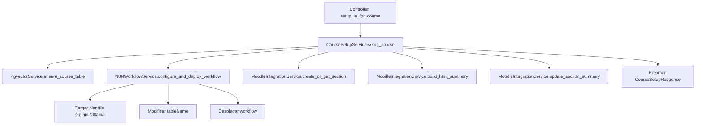

# Refactorización del Endpoint `setup_ia_for_course`

## Resumen

Se ha refactorizado completamente el endpoint `setup_ia_for_course` en `src/entrenai/api/routers/course_setup.py` para mejorar la separación de responsabilidades, simplificar el manejo de errores y hacer el código más mantenible.

## Cambios Realizados

### 1. Creación de Capa de Servicios

Se crearon los siguientes servicios para encapsular la lógica de negocio:

#### `src/entrenai/core/services/pgvector_service.py`
- **Responsabilidad**: Manejo de operaciones de Pgvector
- **Métodos principales**:
  - `ensure_course_table()`: Asegura que la tabla de Pgvector exista
  - `delete_file_chunks()`: Elimina chunks de archivos
  - `delete_file_from_tracker()`: Elimina registros del tracker
  - `is_file_new_or_modified()`: Verifica estado de archivos

#### `src/entrenai/core/services/n8n_workflow_service.py`
- **Responsabilidad**: Gestión de workflows de N8N
- **Características nuevas**:
  - Soporte para plantillas Gemini y Ollama separadas
  - Selección automática de plantilla según `base_config.ai_provider`
  - Modificación automática del `tableName` en el workflow
- **Métodos principales**:
  - `configure_and_deploy_workflow()`: Configura y despliega workflow
  - `delete_workflow_for_course()`: Elimina workflows existentes
  - `_load_workflow_template()`: Carga plantilla apropiada

#### `src/entrenai/core/services/moodle_integration_service.py`
- **Responsabilidad**: Integración con Moodle
- **Métodos principales**:
  - `create_or_get_section()`: Crea/obtiene secciones de Moodle
  - `build_html_summary()`: Construye el HTML summary
  - `update_section_summary()`: Actualiza secciones
  - `extract_chat_config_from_html()`: Extrae configuraciones del HTML

#### `src/entrenai/core/services/course_setup_service.py`
- **Responsabilidad**: Orquestador principal
- **Método principal**: `setup_course()` - Ejecuta todo el flujo de configuración
- **Flujo**: Pgvector → N8N → Moodle

### 2. Funciones Helper Movidas

#### `src/entrenai/core/utils/course_utils.py`
- `get_course_name_for_operations()`: Función helper movida desde el controller
- `get_course_name_from_query_or_moodle()`: Nueva función para obtener nombre del curso

### 3. Plantillas de Workflow Separadas

#### `src/entrenai/core/templates/n8n_workflows/`
- **`gemini_workflow.json`**: Plantilla para la versión paga (Gemini)
- **`ollama_workflow.json`**: Plantilla para la versión gratuita/local (Ollama)

### 4. Controller Simplificado

El endpoint `setup_ia_for_course` ahora:
- **Antes**: ~300 líneas de código complejo
- **Después**: ~15 líneas simples
- Solo maneja validación de parámetros e inyección de dependencias
- Delega toda la lógica al `CourseSetupService`
- Manejo de errores simplificado y general

## Beneficios Obtenidos

### ✅ Separación Clara de Responsabilidades
- **Controller**: Solo manejo de HTTP y validación
- **Services**: Lógica de negocio específica por dominio
- **Utils**: Funciones helper reutilizables

### ✅ Manejo de Errores Simplificado
- **Antes**: Múltiples bloques try-catch granulares
- **Después**: Manejo centralizado y general
- Los servicios manejan errores específicos internamente

### ✅ Código Más Mantenible
- Responsabilidades bien definidas
- Fácil agregar nuevos pasos o modificar existentes
- Testing independiente de cada servicio

### ✅ Soporte Dual de IA (Gemini/Ollama)
- Plantillas separadas para cada proveedor
- Selección automática según configuración
- Fácil extensión para futuros proveedores

### ✅ Logs Mejorados
- Logs claros y concisos en español
- Información relevante en cada paso
- Eliminación de logs redundantes

## Estructura de Archivos

```
src/entrenai/
├── core/
│   ├── services/
│   │   ├── __init__.py
│   │   ├── course_setup_service.py       # [NUEVO] Orquestador principal
│   │   ├── pgvector_service.py           # [NUEVO] Servicio Pgvector
│   │   ├── n8n_workflow_service.py       # [NUEVO] Servicio N8N
│   │   └── moodle_integration_service.py # [NUEVO] Servicio Moodle
│   ├── utils/
│   │   ├── __init__.py
│   │   └── course_utils.py               # [NUEVO] Utilities de curso
│   └── templates/
│       └── n8n_workflows/
│           ├── __init__.py
│           ├── gemini_workflow.json      # [NUEVO] Plantilla Gemini
│           └── ollama_workflow.json      # [NUEVO] Plantilla Ollama
└── api/
    └── routers/
        └── course_setup.py               # [REFACTORIZADO] Controller simplificado
```

## Flujo de Ejecución Después de Refactorización



## Comando de Verificación

Para verificar que la refactorización funciona correctamente:

```bash
# Verificar compilación
python3 -m py_compile src/entrenai/api/routers/course_setup.py

# Verificar sintaxis de servicios
python3 -m py_compile src/entrenai/core/services/*.py
python3 -m py_compile src/entrenai/core/utils/*.py
```

## Próximos Pasos Recomendados

1. **Testing**: Crear tests unitarios para cada servicio
2. **Documentación**: Agregar docstrings detallados a los servicios
3. **Configuración**: Actualizar `.env.example` si es necesario
4. **Validación**: Ejecutar el endpoint en un entorno de desarrollo
5. **Extensión**: Aplicar el mismo patrón a otros endpoints complejos

## Nota Importante

Esta refactorización mantiene la funcionalidad exacta del endpoint original, pero con una arquitectura mucho más limpia y mantenible. No hay cambios en la API externa, por lo que es compatible con clientes existentes.
