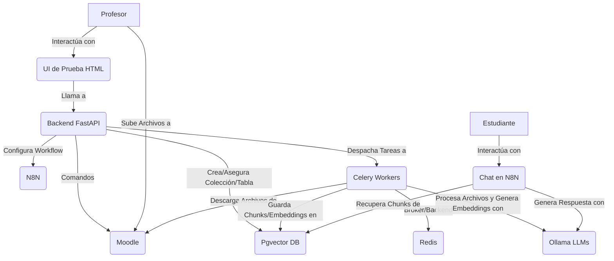

# Título de la Tesis: Entrenai - Sistema Inteligente de Asistencia al Estudiante Basado en RAG para Cursos de Moodle

## Resumen

Entrenai es un sistema de software innovador diseñado para mejorar la experiencia de aprendizaje en la plataforma Moodle mediante la provisión de asistencia inteligente y contextualizada a los estudiantes. El proyecto se centra en implementar un chatbot basado en la técnica de Generación Aumentada por Recuperación (RAG), que permite a los estudiantes realizar preguntas en lenguaje natural y obtener respuestas precisas basadas exclusivamente en el material del curso proporcionado por el profesor. Las funcionalidades principales incluyen la integración con Moodle para la gestión de cursos y materiales, el procesamiento de diversos formatos de documentos, la generación de representaciones vectoriales (embeddings) del contenido para su indexación y búsqueda semántica utilizando Pgvector, y la orquestación de estos procesos a través de una API robusta construida con FastAPI. El sistema utiliza modelos de lenguaje grandes (LLMs) auto-alojados mediante Ollama para garantizar la privacidad de los datos y el control sobre la generación de respuestas. Se espera que Entrenai facilite el acceso a la información, mejore la comprensión de los contenidos y reduzca la carga de trabajo de los docentes al automatizar la respuesta a preguntas frecuentes.

## 1. Introducción

### 1.1. Contexto y Motivación

En la era digital, las plataformas de gestión del aprendizaje (LMS, por sus siglas en inglés), como Moodle, se han convertido en herramientas fundamentales para la educación superior y la formación continua. Estos entornos virtuales ofrecen flexibilidad y acceso a una gran cantidad de recursos educativos. Sin embargo, la abundancia de información puede, paradójicamente, dificultar que los estudiantes encuentren respuestas específicas a sus dudas de manera rápida y eficiente. La necesidad de ofrecer un apoyo más personalizado y disponible las 24 horas del día ha impulsado la búsqueda de soluciones innovadoras que aprovechen los avances en inteligencia artificial (IA).

La motivación principal de este proyecto es desarrollar un sistema de asistencia inteligente que se integre de forma natural en el entorno Moodle, actuando como un tutor virtual capaz de guiar a los estudiantes a través del material del curso. Se busca mejorar la autonomía del estudiante y la eficiencia del proceso de aprendizaje mediante el uso de tecnologías de procesamiento de lenguaje natural y recuperación de información.

### 1.2. Problema a Resolver

Los estudiantes que utilizan plataformas LMS a menudo se enfrentan al desafío de navegar por extensos materiales de curso (documentos, presentaciones, apuntes) para encontrar la información que necesitan. Este proceso puede ser tedioso y llevar a la frustración, especialmente cuando las dudas surgen fuera del horario de consulta con el profesor. La falta de una herramienta de asistencia inmediata y específica para el contenido del curso puede limitar la capacidad del estudiante para resolver interrogantes puntuales y progresar adecuadamente en su aprendizaje.

Entrenai aborda este problema proporcionando un sistema de chatbot que:
*   Permite a los estudiantes realizar preguntas en lenguaje natural sobre el contenido del curso.
*   Ofrece respuestas contextualizadas, basadas exclusivamente en los documentos y materiales cargados por el profesor.
*   Está disponible directamente dentro de la interfaz de Moodle, facilitando su acceso.

### 1.3. Objetivos

#### Objetivo General

Desarrollar un sistema inteligente de asistencia al estudiante, denominado Entrenai, que se integre con la plataforma Moodle y utilice técnicas de Generación Aumentada por Recuperación (RAG) para responder preguntas de los estudiantes basadas en el material específico de un curso.

#### Objetivos Específicos

*   Permitir a los profesores configurar fácilmente una IA de asistencia para sus cursos de Moodle.
*   Procesar automáticamente el material del curso (documentos en formatos como PDF, DOCX, PPTX, TXT, MD) para construir una base de conocimiento específica para cada curso.
*   Implementar una interfaz de chat donde los estudiantes puedan realizar preguntas en lenguaje natural sobre el contenido del curso y obtener respuestas relevantes y contextualizadas.
*   Utilizar modelos de lenguaje grandes (LLMs) auto-alojados (a través de Ollama) para garantizar la privacidad de los datos y el control sobre el proceso de generación de respuestas.
*   Desarrollar una solución modular y extensible que facilite futuras mejoras y adaptaciones.
*   Asegurar que el sistema sea capaz de recuperar y utilizar la información más actualizada de los documentos del curso.

### 1.4. Justificación

La implementación de un sistema como Entrenai se justifica por varios motivos:

*   **Mejora de la Experiencia de Aprendizaje:** Proporciona a los estudiantes una herramienta de apoyo inmediato y accesible, fomentando un aprendizaje más autónomo y reduciendo la barrera de la duda.
*   **Eficiencia para los Docentes:** Puede disminuir la carga de trabajo de los profesores al automatizar la respuesta a preguntas frecuentes sobre el material del curso, permitiéndoles centrarse في aspectos más complejos de la enseñanza.
*   **Innovación Educativa:** Introduce el uso de tecnologías de IA avanzadas en el entorno educativo, preparando a las instituciones y a los estudiantes para las herramientas del futuro.
*   **Privacidad y Control de Datos:** Al utilizar LLMs auto-alojados, se mantiene el control sobre los datos del curso y de los estudiantes, un aspecto crucial para las instituciones educativas.
*   **Escalabilidad:** Aunque enfocado inicialmente en cursos individuales, la arquitectura modular sienta las bases para una posible expansión a nivel institucional.

### 1.5. Alcance y Limitaciones

**Funcionalidades Cubiertas:**

*   Listado de cursos de Moodle disponibles para un profesor.
*   Configuración de la IA para un curso seleccionado, incluyendo la creación automática de elementos necesarios en Moodle (sección, carpeta para documentos, enlaces al chat y a la función de refresco de contenidos).
*   Creación y gestión de una base de conocimiento vectorial específica para el curso en Pgvector.
*   Despliegue y configuración de un workflow de chat en N8N.
*   Procesamiento de archivos (PDF, DOCX, PPTX, TXT, MD) subidos por el profesor a la carpeta designada en Moodle:
    *   Descarga de archivos nuevos o modificados.
    *   Extracción de texto.
    *   Formateo del texto extraído a un formato Markdown limpio.
    *   División del texto en fragmentos (chunks) manejables.
    *   Generación de representaciones vectoriales (embeddings) para cada fragmento.
    *   Almacenamiento de los fragmentos y sus embeddings en la base de datos Pgvector.
*   Interfaz de chat (accesible vía N8N) para que los estudiantes realicen preguntas y reciban respuestas generadas por el sistema RAG, utilizando el material del curso como única fuente de verdad.
*   Procesamiento asíncrono de archivos para no bloquear la interfaz de usuario.
*   API para consultar el estado de procesamiento de los archivos.

**Limitaciones Actuales y Funcionalidades No Cubiertas (Posibles Mejoras Futuras):**

*   La interfaz de profesor es básica, enfocada en la configuración inicial. No incluye gestión avanzada de la IA post-configuración.
*   El soporte para tipos de archivo está limitado a los formatos más comunes mencionados; no incluye audio, video u otros formatos multimedia.
*   No existen mecanismos integrados para que los estudiantes proporcionen feedback directo sobre la calidad de las respuestas del chat.
*   No se incluyen analíticas detalladas sobre el uso del chatbot o las preguntas más frecuentes.
*   La parametrización del workflow de N8N (por ejemplo, para ajustar el comportamiento del chat) no se puede realizar directamente desde la API de Entrenai una vez desplegado.
*   La evaluación de la calidad de las respuestas es principalmente cualitativa en esta fase.

### 1.6. Estructura del Documento

Este documento de tesis se organiza de la siguiente manera:
*   **Capítulo 1 (Introducción):** Presenta el contexto, el problema, los objetivos, la justificación y el alcance del proyecto.
*   **Capítulo 2 (Marco Teórico):** Describe los conceptos y tecnologías fundamentales que sustentan el desarrollo de Entrenai.
*   **Capítulo 3 (Diseño y Metodología):** Detalla la arquitectura del sistema, los flujos de datos, las tecnologías seleccionadas y la metodología de desarrollo.
*   **Capítulo 4 (Implementación):** Describe el proceso de desarrollo de los componentes clave del sistema y los desafíos encontrados. (Este capítulo se mantendrá a un nivel conceptual en esta versión).
*   **Capítulo 5 (Pruebas y Resultados):** Presenta la estrategia de pruebas y los resultados esperados o preliminares. (Este capítulo se mantendrá a un nivel conceptual en esta versión).
*   **Capítulo 6 (Conclusiones y Trabajo Futuro):** Resume las conclusiones del proyecto y propone líneas de investigación y desarrollo futuras. (Este capítulo se mantendrá a un nivel conceptual en esta versión).
*   **Referencias Bibliográficas:** Lista las fuentes consultadas.
*   **Apéndices:** Incluye información complementaria como manuales de usuario.

## 2. Marco Teórico

### 2.1. Plataformas LMS (Moodle)
Las Plataformas de Gestión del Aprendizaje (Learning Management Systems - LMS) son aplicaciones de software que permiten la administración, documentación, seguimiento, generación de informes y entrega de cursos educativos o programas de formación. Moodle es uno de los LMS de código abierto más utilizados a nivel mundial, conocido por su flexibilidad y su amplia comunidad de usuarios y desarrolladores. Para Entrenai, Moodle representa el ecosistema donde residen los cursos, los materiales didácticos y los usuarios (profesores y estudiantes). La integración con Moodle es clave para que Entrenai pueda acceder al contenido de los cursos y ofrecer una experiencia de usuario fluida y familiar.

### 2.2. Modelos de Lenguaje Grandes (LLMs)
Los Modelos de Lenguaje Grandes (Large Language Models - LLMs) son modelos de inteligencia artificial que han sido entrenados con enormes cantidades de datos de texto para comprender, generar y manipular el lenguaje humano con una sofisticación notable. Ejemplos conocidos incluyen la familia GPT de OpenAI o modelos de código abierto como Llama. En Entrenai, los LLMs juegan un papel crucial en dos áreas: primero, en la generación de "embeddings" o representaciones numéricas del significado del texto de los documentos; y segundo, en la generación de respuestas coherentes y contextualmente relevantes a las preguntas de los estudiantes, utilizando la información recuperada de los materiales del curso. El uso de LLMs auto-alojados mediante Ollama permite un mayor control sobre los datos y la infraestructura.

### 2.3. Generación Aumentada por Recuperación (RAG)
La Generación Aumentada por Recuperación (Retrieval Augmented Generation - RAG) es una técnica de inteligencia artificial que combina las capacidades de generación de texto de los LLMs con la recuperación de información de una base de conocimiento externa. En lugar de depender únicamente del conocimiento interno del LLM (adquirido durante su entrenamiento), un sistema RAG primero busca información relevante en una fuente de datos específica (en el caso de Entrenai, los documentos del curso). Luego, esta información recuperada se proporciona al LLM junto con la pregunta del usuario, para que genere una respuesta "aumentada" o fundamentada en esos datos. Este enfoque es fundamental para Entrenai, ya que asegura que las respuestas del chatbot se basen estrictamente en el material del curso, aumentando la precisión y reduciendo la probabilidad de que el LLM genere información incorrecta o no pertinente ("alucinaciones").

### 2.4. Bases de Datos Vectoriales (Pgvector)
Las bases de datos vectoriales son sistemas especializados en almacenar y buscar datos en forma de vectores de alta dimensionalidad, conocidos como "embeddings". Estos embeddings representan el significado semántico del contenido (texto, imágenes, etc.). Pgvector es una extensión para PostgreSQL que añade la capacidad de almacenar y buscar vectores de embeddings. En Entrenai, después de que los documentos del curso son procesados y convertidos en embeddings por un LLM, estos embeddings se almacenan en Pgvector. Cuando un estudiante realiza una pregunta, esta también se convierte en un embedding, y Pgvector se utiliza para encontrar los fragmentos de texto de los documentos cuyos embeddings son más "similares" o cercanos semánticamente al embedding de la pregunta. Esta capacidad de búsqueda por similitud es esencial para el componente de recuperación en la arquitectura RAG.

### 2.5. Herramientas de Automatización de Workflows (N8N)
N8N es una plataforma de automatización de flujos de trabajo (workflows) de código abierto que permite conectar diferentes aplicaciones y servicios para crear procesos automatizados de forma visual. En Entrenai, N8N se utiliza para implementar la lógica del chatbot. Esto incluye recibir la pregunta del estudiante a través de un webhook, coordinar la generación del embedding de la pregunta, realizar la consulta a Pgvector para obtener el contexto relevante, interactuar con el LLM para generar la respuesta y, finalmente, devolver esa respuesta al estudiante. El uso de N8N simplifica la creación y modificación del flujo del chat sin necesidad de codificar toda esta lógica directamente en el backend principal.

### 2.6. Procesamiento de Lenguaje Natural (NLP) y Embeddings
El Procesamiento de Lenguaje Natural (NLP) es un campo de la inteligencia artificial que se enfoca en la interacción entre las computadoras y el lenguaje humano. Incluye tareas como la comprensión, interpretación y generación de texto. Los "embeddings" (o incrustaciones léxicas) son un concepto central en el NLP moderno. Son representaciones vectoriales (listas de números) de palabras, frases o documentos completos, donde la posición y distancia entre vectores en ese espacio numérico capturan relaciones semánticas. Por ejemplo, palabras con significados similares tendrán embeddings cercanos. Entrenai utiliza LLMs para generar embeddings tanto del material del curso como de las preguntas de los estudiantes, lo que permite al sistema "entender" y comparar el significado del texto para la recuperación de información relevante.

### 2.7. Tecnologías Relacionadas (FastAPI, Ollama, Docker)
*   **FastAPI:** Es un framework web moderno y de alto rendimiento para construir APIs (Interfaces de Programación de Aplicaciones) con Python. En Entrenai, FastAPI se utiliza para desarrollar el backend del sistema, que orquesta la comunicación entre Moodle, Pgvector, Ollama y N8N, además de gestionar la lógica de negocio.
*   **Ollama:** Es una herramienta que facilita la ejecución de modelos de lenguaje grandes (LLMs) de código abierto de forma local. Entrenai utiliza Ollama para auto-alojar los LLMs necesarios para la generación de embeddings y la formulación de respuestas, asegurando así la privacidad de los datos y el control sobre los modelos.
*   **Docker:** Es una plataforma de contenedores que permite empaquetar aplicaciones y sus dependencias en unidades aisladas llamadas contenedores. Entrenai utiliza Docker (y Docker Compose) para simplificar la configuración y ejecución de los diversos servicios que componen el sistema (como Moodle, la base de datos PostgreSQL con Pgvector, Ollama, N8N y Redis), garantizando un entorno de desarrollo y despliegue consistente.

## 3. Diseño y Metodología del Sistema "Entrenai"

### 3.1. Arquitectura General del Sistema

El sistema Entrenai está diseñado como un conjunto de módulos que interactúan para proporcionar asistencia inteligente a los estudiantes. La arquitectura se centra en la integración con Moodle y el uso de un flujo RAG para generar respuestas.

#### Diagrama de Arquitectura



#### Descripción de Componentes

*   **Frontend (UI de Prueba):** Una interfaz web sencilla (HTML, CSS, JavaScript) que permite al profesor interactuar con la API de Entrenai para listar sus cursos de Moodle e iniciar la configuración de la IA para un curso seleccionado.
*   **Backend (FastAPI):** El núcleo del sistema. Expone una API REST que gestiona la configuración de los cursos, el procesamiento de archivos y la comunicación con los demás servicios (Moodle, Pgvector, Ollama, N8N).
*   **Moodle:** La plataforma LMS donde residen los cursos y los materiales. Entrenai interactúa con Moodle mediante sus Web Services para listar cursos, crear secciones y módulos (carpetas para documentos, enlaces al chat), y descargar los archivos subidos por el profesor.
*   **Ollama:** Servicio que permite ejecutar LLMs localmente. Entrenai lo utiliza para generar los embeddings del contenido de los documentos y para generar las respuestas del chatbot.
*   **Pgvector (sobre PostgreSQL):** Base de datos vectorial utilizada para almacenar los fragmentos de texto (chunks) de los documentos del curso junto con sus embeddings, permitiendo búsquedas semánticas eficientes.
*   **N8N:** Plataforma de automatización de workflows que implementa la lógica del chatbot. Gestiona la recepción de preguntas, la consulta a Pgvector, la interacción con Ollama para generar la respuesta y la devolución de esta al estudiante.
*   **Celery:** Sistema de colas de tareas distribuidas que maneja el procesamiento de archivos de forma asíncrona. Cuando un profesor solicita refrescar los archivos de un curso, el backend despacha tareas a Celery para que los workers procesen cada archivo individualmente sin bloquear la respuesta de la API.
*   **Redis:** Almacén de datos en memoria que actúa como intermediario de mensajes (message broker) para Celery y como backend para almacenar los resultados de las tareas.

### 3.2. Flujo de Usuario y Datos

El sistema Entrenai opera a través de tres flujos principales, los cuales se pueden visualizar en el siguiente diagrama de secuencia:

```mermaid
sequenceDiagram
    actor Profesor
    actor Estudiante
    participant UI_Prueba as "UI de Prueba (Frontend)"
    participant FastAPI as "Backend FastAPI"
    participant Moodle
    participant Pgvector as "Pgvector DB"
    participant N8N
    participant Celery as "Celery Workers"
    participant Ollama as "Ollama LLMs"
    participant FileTracker as "FileTracker (DB)"

    box rgb(230, 245, 255) Flujo 1: Configuración Inicial por el Profesor
        Profesor->>UI_Prueba: Accede y selecciona curso
        UI_Prueba->>FastAPI: POST /api/v1/courses/{course_id}/setup-ia
        activate FastAPI
        FastAPI->>Moodle: Crea sección, carpeta y links
        Moodle-->>FastAPI: Confirmación/Datos creación
        FastAPI->>Pgvector: Asegura existencia de tabla/colección
        Pgvector-->>FastAPI: Confirmación tabla
        FastAPI->>N8N: Configura y despliega workflow de chat
        N8N-->>FastAPI: Confirmación/Datos workflow (ej. URL webhook)
        FastAPI-->>UI_Prueba: Confirmación de configuración
        deactivate FastAPI
        UI_Prueba-->>Profesor: Muestra confirmación
    end

    box rgb(230, 255, 230) Flujo 2: Subida y Procesamiento de Archivos
        Profesor->>Moodle: Sube archivos a carpeta designada
        Profesor->>FastAPI: GET /api/v1/courses/{course_id}/refresh-files (vía link en Moodle)
        activate FastAPI
        FastAPI->>Moodle: Lista archivos de la carpeta
        Moodle-->>FastAPI: Lista de archivos
        FastAPI->>FileTracker: Verifica archivos nuevos/modificados
        FileTracker-->>FastAPI: Lista de archivos a procesar
        loop Para cada archivo nuevo/modificado
            FastAPI->>Celery: Despacha tarea de procesamiento (ID archivo, ID curso)
        end
        FastAPI-->>Profesor: Lista de IDs de tareas despachadas
        deactivate FastAPI

        activate Celery
        Note over Celery: Los workers procesan tareas en paralelo
        Celery->>Moodle: Descarga archivo
        Moodle-->>Celery: Contenido del archivo
        Celery->>Ollama: Extrae texto, formatea, genera embeddings
        Ollama-->>Celery: Chunks y embeddings
        Celery->>Pgvector: Guarda chunks y embeddings
        Pgvector-->>Celery: Confirmación guardado
        Celery->>FileTracker: Actualiza estado del archivo (ej. procesado, timestamp)
        FileTracker-->>Celery: Confirmación actualización
        deactivate Celery
        
        opt Consulta Estado de Tareas
            Profesor->>FastAPI: GET /api/v1/task/{task_id}/status
            activate FastAPI
            FastAPI->>Celery: (Indirectamente vía backend de resultados Redis) Consulta estado
            Celery-->>FastAPI: Estado de la tarea
            FastAPI-->>Profesor: Estado de la tarea
            deactivate FastAPI
        end
    end

    box rgb(255, 245, 230) Flujo 3: Interacción del Estudiante con el Chatbot
        Estudiante->>N8N: Envía pregunta (vía Chat en Moodle)
        activate N8N
        N8N->>Ollama: Genera embedding de la pregunta
        Ollama-->>N8N: Embedding de la pregunta
        N8N->>Pgvector: Busca chunks relevantes con embedding
        Pgvector-->>N8N: Chunks relevantes
        N8N->>Ollama: Genera respuesta (RAG) con pregunta y chunks
        Ollama-->>N8N: Respuesta generada
        N8N-->>Estudiante: Devuelve respuesta al chat
        deactivate N8N
    end
```

A continuación, se describen estos flujos en detalle:

#### Configuración Inicial por el Profesor

1.  **Acceso y Selección:** El profesor accede a una interfaz web simple proporcionada por Entrenai. En esta interfaz, puede ver una lista de los cursos de Moodle en los que está inscrito. Selecciona el curso para el cual desea activar la asistencia inteligente.
2.  **Activación de la IA:** Al confirmar la selección, el sistema Entrenai (a través de su backend) realiza varias acciones:
    *   **En Moodle:** Crea una nueva sección dentro del curso (ej. "Asistente IA Entrenai"), y dentro de ella, una carpeta donde el profesor deberá subir los documentos del curso. También crea enlaces directos al chat del asistente y a una función para "refrescar" los archivos (volver a procesarlos).
    *   **En Pgvector:** Prepara la base de datos para almacenar la información del curso (asegura la existencia de las tablas necesarias).
    *   **En N8N:** Despliega y configura un workflow de chat específico para ese curso, conectándolo con la base de datos Pgvector correspondiente y los modelos de lenguaje en Ollama.
3.  **Confirmación:** El profesor recibe una notificación de que la IA ha sido configurada para el curso.

#### Subida y Procesamiento de Archivos

1.  **Subida de Documentos:** El profesor sube los materiales del curso (archivos PDF, DOCX, PPTX, etc.) a la carpeta creada por Entrenai dentro de su curso en Moodle.
2.  **Solicitud de Procesamiento:** El profesor, a través de un enlace en Moodle o una interfaz en Entrenai, solicita que se procesen o "refresquen" los archivos del curso.
3.  **Procesamiento Asíncrono:**
    *   El backend de Entrenai identifica los archivos nuevos o modificados en la carpeta de Moodle.
    *   Para cada archivo, se envía una tarea a los workers de Celery. Estos workers, ejecutándose en segundo plano:
        *   Descargan el archivo de Moodle.
        *   Extraen el texto del documento.
        *   Limpian y formatean el texto (por ejemplo, a Markdown).
        *   Dividen el texto en fragmentos más pequeños (chunks).
        *   Utilizan un LLM (vía Ollama) para generar un embedding (representación vectorial) para cada chunk.
        *   Almacenan estos chunks junto con sus embeddings en la base de datos Pgvector, asociándolos al curso correspondiente.
    *   El profesor puede consultar el estado de estas tareas de procesamiento.

#### Interacción del Estudiante con el Chatbot

1.  **Acceso al Chat:** El estudiante accede al chat a través de un enlace en la página del curso en Moodle. Este enlace lo dirige al workflow de N8N.
2.  **Realización de Preguntas:** El estudiante escribe su pregunta en lenguaje natural en la interfaz de chat.
3.  **Generación de Respuesta (RAG):**
    *   El workflow de N8N recibe la pregunta.
    *   Se genera un embedding para la pregunta del estudiante utilizando Ollama.
    *   N8N consulta la base de datos Pgvector, buscando los chunks de texto de los documentos del curso cuyos embeddings sean más similares al embedding de la pregunta.
    *   Los chunks recuperados (el contexto) y la pregunta original se envían a un LLM (vía Ollama).
    *   El LLM genera una respuesta basada en la pregunta y la información proporcionada en los chunks.
    *   N8N devuelve la respuesta generada al estudiante a través del chat.

### 3.3. Tecnologías Utilizadas

La elección de las tecnologías para Entrenai se basó en criterios de eficiencia, flexibilidad, coste (preferencia por código abierto) y facilidad de integración:

*   **Python 3.9+:** Lenguaje de programación principal, por su amplio ecosistema para IA y desarrollo web.
*   **FastAPI:** Para la creación del backend API, debido a su alto rendimiento, facilidad para definir tipos de datos y generación automática de documentación.
*   **Moodle:** Como plataforma LMS objetivo, la integración se realiza mediante sus servicios web estándar.
*   **Pgvector (sobre PostgreSQL):** Como base de datos vectorial, elegida por su integración con PostgreSQL, su naturaleza de código abierto y su eficiencia en búsquedas de similitud.
*   **Ollama:** Para el auto-alojamiento de LLMs, permitiendo el uso de modelos de lenguaje de vanguardia de forma local, asegurando la privacidad de los datos y evitando costes de APIs externas.
*   **N8N:** Para la automatización del workflow del chatbot, por su interfaz visual que facilita la creación y modificación de la lógica del chat.
*   **Celery y Redis:** Para la gestión de tareas asíncronas (procesamiento de archivos), mejorando la responsividad del sistema. Celery maneja la distribución de tareas y Redis actúa como intermediario de mensajes.
*   **Docker & Docker Compose:** Para la contenedorización de todos los servicios, simplificando enormemente la configuración del entorno de desarrollo y el futuro despliegue.

### 3.4. Diseño de la Base de Datos Vectorial (Pgvector)

La base de datos vectorial es el corazón del sistema de recuperación de información de Entrenai. En lugar de realizar búsquedas por palabras clave, permite encontrar información basada en el significado o contexto semántico.

*   **Concepto:** Cuando los documentos del curso se procesan, el texto se divide en fragmentos (chunks). Cada uno de estos chunks se convierte en un "vector" numérico (embedding) mediante un modelo de lenguaje. Estos vectores se almacenan en Pgvector.
*   **Almacenamiento:** Se utiliza una tabla en PostgreSQL con la extensión Pgvector. Cada fila en esta tabla puede representar un chunk de un documento y contiene, además del propio texto del chunk, su vector embedding y metadatos relevantes como el ID del curso, el nombre del archivo original, y posiblemente el número de página o sección.
*   **Búsqueda:** Cuando un estudiante hace una pregunta, esta también se convierte en un vector. Pgvector luego compara este vector de pregunta con todos los vectores almacenados de los chunks del curso y devuelve los que son más "cercanos" o "similares" semánticamente. Estos chunks recuperados forman el contexto que el LLM utilizará para responder.

### 3.5. Diseño del Workflow de Chat (N8N)

N8N se utiliza para orquestar la interacción del chatbot de manera visual y modular. El workflow típico incluye:

1.  **Recepción de la Pregunta:** Un nodo "Webhook" espera las preguntas enviadas por los estudiantes desde la interfaz de chat en Moodle.
2.  **Procesamiento de la Pregunta:** Se genera un embedding de la pregunta del estudiante (usualmente llamando a una función en Ollama).
3.  **Búsqueda de Contexto:** Se realiza una consulta a la base de datos Pgvector (a través de un nodo PostgreSQL o una llamada a la API de Entrenai) para obtener los fragmentos de texto más relevantes.
4.  **Generación de Respuesta:** Se combinan la pregunta original y los fragmentos recuperados en un "prompt" que se envía a un LLM (vía Ollama) para que genere una respuesta.
5.  **Envío de Respuesta:** La respuesta generada por el LLM se devuelve al estudiante a través de la interfaz de chat.

Este diseño permite modificar fácilmente la lógica del chat, añadir pasos intermedios (como filtrado de contenido, registro de preguntas, etc.) o cambiar los servicios utilizados con relativa facilidad.

### 3.6. Procesamiento y Extracción de Contenido de Archivos

Entrenai está diseñado para extraer texto de los formatos de archivo más comunes utilizados en el ámbito académico:

*   **PDF:** Se utilizan bibliotecas para extraer texto directamente de archivos PDF. En casos de PDFs basados en imágenes, se podría integrar OCR (Reconocimiento Óptico de Caracteres), aunque esto añade complejidad.
*   **DOCX (Microsoft Word):** Se emplean bibliotecas capaces de leer el contenido de estos archivos.
*   **PPTX (Microsoft PowerPoint):** Similarmente, se extrae el contenido textual de las diapositivas.
*   **TXT y MD (Texto Plano y Markdown):** Estos formatos son más directos de procesar.

El texto extraído se limpia (eliminando caracteres innecesarios, normalizando espacios, etc.) y, a menudo, se convierte a un formato Markdown común antes de ser dividido en chunks.

### 3.7. Generación y Gestión de Embeddings

Este es un paso crucial para que el sistema "comprenda" el contenido:

1.  **Chunking (División en Fragmentos):** El texto extraído de cada documento se divide en fragmentos más pequeños y manejables (chunks). Esta división se realiza de manera que cada chunk mantenga coherencia semántica, y a menudo se utiliza un solapamiento entre chunks para no perder contexto en los puntos de corte.
2.  **Generación de Embeddings:** Cada chunk de texto se pasa a un modelo de lenguaje especializado en generar embeddings (ej. `nomic-embed-text` ejecutado en Ollama). El modelo devuelve un vector numérico que representa el significado de ese chunk.
3.  **Almacenamiento:** Estos embeddings, junto con el texto original del chunk y sus metadatos, se almacenan en la base de datos Pgvector.

Este proceso asegura que cuando un estudiante pregunta algo, el sistema pueda encontrar los fragmentos exactos de los documentos que se relacionan semánticamente con la pregunta.

### 3.8. Metodología de Desarrollo

El desarrollo de Entrenai sigue una metodología iterativa e incremental. Esto implica:

*   Desarrollar el sistema en ciclos cortos, añadiendo funcionalidades de manera progresiva.
*   Priorizar las características más críticas al inicio (como la integración básica con Moodle, el procesamiento de un tipo de archivo y el flujo RAG).
*   Realizar pruebas continuas en cada iteración para identificar y corregir errores tempranamente.
*   Adaptar el diseño y las prioridades basándose en los resultados de las pruebas y el feedback obtenido (si es posible).

Este enfoque permite una mayor flexibilidad para adaptarse a los desafíos que surjan durante el desarrollo y asegura que se entregue un producto funcional en etapas tempranas.

## 4. Implementación

(Esta sección se desarrollará con mayor detalle a medida que avance la implementación práctica del proyecto. Por ahora, se presenta una descripción general de los aspectos clave).

### 4.1. Configuración del Entorno de Desarrollo

La configuración del entorno de desarrollo se ha simplificado significativamente mediante el uso de Docker y Docker Compose. Esto permite definir y ejecutar todos los servicios externos necesarios (Moodle, PostgreSQL con Pgvector, Ollama, N8N, Redis) como contenedores aislados. Cada servicio se configura mediante variables de entorno (gestionadas a través de un archivo `.env`), lo que facilita la portabilidad y la consistencia entre diferentes máquinas de desarrollo y el futuro entorno de producción.

### 4.2. Desarrollo del Backend (FastAPI)

El backend, desarrollado con FastAPI, actúa como el orquestador central del sistema. Sus responsabilidades incluyen:
*   Exponer los endpoints de la API REST para la interfaz de usuario del profesor y para la comunicación con otros servicios (como N8N).
*   Implementar la lógica para interactuar con Moodle (cliente `MoodleClient`) para la gestión de cursos y archivos.
*   Gestionar la base de datos Pgvector (wrapper `PgvectorWrapper`) para el almacenamiento y recuperación de embeddings.
*   Comunicarse con Ollama (wrapper `OllamaWrapper`) para solicitar la generación de embeddings y la completación de texto para el chat.
*   Interactuar con la API de N8N (cliente `N8NClient`) para configurar y desplegar los workflows de chat.
*   Despachar tareas de procesamiento de archivos a Celery.

### 4.3. Implementación del Procesamiento de Archivos

El procesamiento de archivos involucra varios componentes:
*   `FileProcessor`: Clases específicas para cada tipo de archivo (PDF, DOCX, etc.) que se encargan de la extracción del texto.
*   `EmbeddingManager`: Orquesta la división del texto en chunks, la generación de embeddings a través del `OllamaWrapper`, y la preparación de los datos para su almacenamiento.
*   `FileTracker`: Un mecanismo (posiblemente una pequeña base de datos SQLite o similar) para llevar un registro de los archivos que ya han sido procesados y sus fechas de modificación, evitando el reprocesamiento innecesario.
Las tareas de procesamiento se ejecutan de forma asíncrona por workers de Celery.

### 4.4. Configuración del Workflow en N8N

Se diseña una plantilla de workflow en N8N que contiene la lógica del chat RAG. Esta plantilla se importa y activa mediante la API de N8N durante la configuración inicial del curso. El workflow se parametriza con identificadores específicos del curso (como el nombre de la colección o tabla en Pgvector) para asegurar que cada chat interactúe con la base de conocimiento correcta.

### 4.5. Desafíos Encontrados y Soluciones Aplicadas

(Esta sección se completará con los desafíos específicos que surjan durante el desarrollo y las soluciones implementadas. Un desafío común podría ser la optimización de la calidad de los chunks recuperados o el manejo eficiente de diferentes formatos de documentos).
Como ejemplo general, un desafío inicial es asegurar la correcta extracción de texto de diversos formatos de archivo, especialmente PDFs con estructuras complejas. La solución implica probar y seleccionar cuidadosamente las bibliotecas de extracción y aplicar técnicas de preprocesamiento de texto robustas. Otro desafío es la optimización de los prompts enviados al LLM para la generación de respuestas, lo cual requiere experimentación iterativa.

## 5. Pruebas y Resultados

(Esta sección se completará con los resultados de las pruebas una vez que el sistema esté suficientemente desarrollado).

### 5.1. Estrategia de Pruebas

Se planifica una estrategia de pruebas que abarque diferentes niveles:
*   **Pruebas Unitarias:** Se realizarán pruebas para verificar el correcto funcionamiento de los componentes individuales (módulos, funciones) de forma aislada, utilizando datos de prueba y mocks para las dependencias externas.
*   **Pruebas de Integración:** Se probará la interacción entre los diferentes componentes del sistema (API FastAPI, Moodle, Pgvector, Ollama, N8N, Celery, Redis) para asegurar que se comunican y colaboran correctamente. Estas pruebas requerirán que los servicios Docker estén activos y configurados.
*   **Pruebas de Usuario (Funcionales):** Se simularán los flujos de usuario completos, desde la configuración del curso por el profesor hasta la interacción del estudiante con el chatbot, para verificar que el sistema cumple con los requisitos funcionales.

### 5.2. Casos de Prueba

Se definirán casos de prueba específicos para cubrir las funcionalidades clave, incluyendo:
*   Configuración de un nuevo curso y creación de elementos en Moodle.
*   Subida y procesamiento de diferentes tipos de archivo.
*   Correcta generación y almacenamiento de embeddings.
*   Recuperación de chunks relevantes de Pgvector basados en preguntas de prueba.
*   Generación de respuestas coherentes y basadas en el contexto por el chatbot.
*   Manejo de errores y situaciones excepcionales.

### 5.3. Resultados Obtenidos

Se espera que los resultados de las pruebas demuestren:
*   **Funcionalidad Completa:** Que todas las características descritas en el alcance del proyecto operan según lo esperado.
*   **Calidad de las Respuestas:** Una evaluación (inicialmente cualitativa, y si es posible, cuantitativa mediante métricas como RAGAs o similares con datos de prueba) de la precisión, relevancia y coherencia de las respuestas del chatbot.
*   **Rendimiento del Sistema:** Medición de tiempos de respuesta para el procesamiento de archivos y para las interacciones del chat, identificando posibles cuellos de botella.
*   **Estabilidad y Robustez:** Capacidad del sistema para manejar operaciones concurrentes (múltiples usuarios o tareas de procesamiento) y recuperarse de errores.

## 6. Conclusiones y Trabajo Futuro

(Esta sección se completará al finalizar el proyecto).

### 6.1. Conclusiones Principales
(Se resumirán los logros del proyecto, la efectividad del enfoque RAG y la viabilidad de la solución propuesta).

### 6.2. Cumplimiento de Objetivos
(Se analizará en qué medida se alcanzaron los objetivos generales y específicos planteados al inicio del proyecto).

### 6.3. Limitaciones del Sistema Desarrollado
(Se identificarán las limitaciones inherentes al diseño actual o las funcionalidades que no pudieron ser implementadas completamente).

### 6.4. Líneas de Trabajo Futuro
Se pueden prever varias líneas de mejora y expansión para Entrenai:
*   **Mejoras en el RAG:** Implementación de técnicas de re-ranking de los chunks recuperados, estrategias de contextualización más avanzadas para los prompts, o la capacidad de hacer preguntas de seguimiento.
*   **Soporte para Más Tipos de Archivo:** Extender la capacidad de procesamiento para incluir otros formatos multimedia (audio, video) o tipos de documentos más complejos (ej. LaTeX).
*   **Interfaz de Profesor Avanzada:** Desarrollar una interfaz más completa para que los profesores puedan gestionar la IA de sus cursos, revisar las preguntas de los estudiantes, y posiblemente curar o mejorar las respuestas.
*   **Mecanismos de Feedback del Estudiante:** Integrar un sistema para que los estudiantes puedan calificar la utilidad de las respuestas del chatbot, lo que podría usarse para mejorar el sistema.
*   **Analíticas de Uso:** Incorporar un panel de control para que los profesores vean estadísticas sobre el uso del chatbot, las preguntas más frecuentes, etc.
*   **Escalabilidad y Optimización:** Mejorar el rendimiento para soportar un mayor número de usuarios y cursos, y optimizar el uso de recursos.
*   **Multilingüismo:** Adaptar el sistema para procesar documentos y responder preguntas en múltiples idiomas.

## 7. Referencias Bibliográficas

(Se listarán aquí todas las fuentes académicas, artículos, documentación técnica y otros recursos consultados durante el desarrollo del proyecto).

## Apéndices

### Apéndice A: Manual de Usuario (Profesor y Estudiante)
(Se incluirá un manual detallado sobre cómo los profesores pueden configurar y utilizar Entrenai en sus cursos, y cómo los estudiantes pueden interactuar con el chatbot. Este podría ser un documento separado referenciado aquí).

### Apéndice B: Configuración de Variables de Entorno
(Se proporcionará una lista y descripción de todas las variables de entorno necesarias para configurar y ejecutar el sistema Entrenai. Esta información se basará en el archivo `.env.example`).

### Apéndice C: Código Fuente Relevante (Fragmentos)
(Se podrían incluir fragmentos de código que sean particularmente ilustrativos de la implementación de algoritmos clave o de la interacción entre componentes, si se considera pertinente para la tesis).
