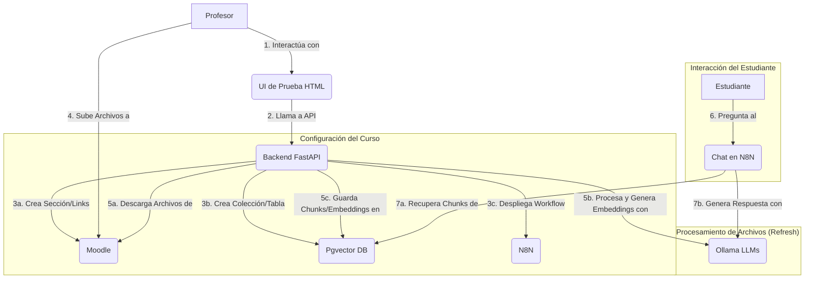

# Entrenai - Manual Técnico

## 1. Introducción

Entrenai es un sistema diseñado para proveer asistencia inteligente a estudiantes dentro de cursos específicos de la plataforma Moodle. Utiliza un enfoque de Generación Aumentada por Recuperación (RAG) para analizar el material del curso proporcionado por el profesor y responder preguntas de los estudiantes basadas en dicho material.

El objetivo principal es facilitar el acceso a la información del curso, permitiendo a los estudiantes obtener respuestas relevantes y contextualizadas de manera rápida y eficiente, directamente desde una interfaz de chat integrada en Moodle.

Este documento detalla la arquitectura, las decisiones de diseño, la estructura de datos y los flujos de procesos del proyecto Entrenai, sirviendo como guía para desarrolladores y administradores del sistema.

## 2. Objetivos del Proyecto

*   Permitir a los profesores configurar fácilmente una IA de asistencia para sus cursos de Moodle.
*   Procesar automáticamente el material del curso (documentos PDF, DOCX, PPTX, TXT, MD) para construir una base de conocimiento.
*   Ofrecer a los estudiantes una interfaz de chat para realizar preguntas sobre el contenido del curso y obtener respuestas relevantes y contextualizadas.
*   Utilizar modelos de lenguaje grandes (LLMs) auto-alojados para garantizar la privacidad y el control sobre los datos.
*   Proporcionar una solución modular y extensible.

## 3. Alcance

### Funcionalidades Cubiertas:

*   Listado de cursos de Moodle para un profesor.
*   Configuración de la IA para un curso seleccionado (creación de sección y elementos en Moodle, colección/tabla en Pgvector, despliegue de workflow en N8N).
*   Procesamiento de archivos subidos a una carpeta específica en Moodle:
    *   Descarga de archivos nuevos/modificados.
    *   Extracción de texto de diversos formatos.
    *   Formateo del texto a Markdown.
    *   División del texto en chunks.
    *   Generación de embeddings para los chunks.
    *   Almacenamiento de chunks y embeddings en Pgvector.
*   Interfaz de chat (vía N8N) para que los estudiantes realicen preguntas y reciban respuestas basadas en el material del curso.
*   Procesamiento Asíncrono de Archivos: La ingesta y procesamiento de archivos de Moodle se realiza de forma asíncrona utilizando Celery y Redis, mejorando la respuesta de la API.
*   Seguimiento del Estado de Tareas: Se proporciona un endpoint API para consultar el estado de las tareas de procesamiento de archivos.
*   API Backend Robusta: Una API desarrollada con FastAPI orquesta todas las operaciones, desde la configuración inicial hasta el procesamiento de archivos y la interacción con los diferentes servicios.
*   Interfaz de Usuario Simple: Incluye una UI de prueba básica para que los profesores puedan listar sus cursos e iniciar la configuración de la IA.

### Funcionalidades No Cubiertas (Posibles Mejoras Futuras):

*   Interfaz de profesor avanzada para gestión de IA (más allá de la UI de prueba).
*   Soporte para tipos de archivo adicionales.
*   Mecanismos de feedback para las respuestas del chat.
*   Analíticas de uso.
*   Parametrización avanzada del workflow de N8N directamente desde la API.

## 4. Arquitectura del Sistema

El sistema Entrenai se compone de los siguientes módulos principales que interactúan entre sí:

*   **Frontend (UI de Prueba):** Una interfaz web simple (HTML, CSS, JavaScript servida por FastAPI en `static/index.html`) que permite al profesor listar sus cursos de Moodle e iniciar el proceso de configuración de la IA para un curso seleccionado.
*   **Backend (FastAPI):** Es el cerebro del sistema. Expone una API REST que orquesta todas las operaciones, incluyendo la comunicación con Moodle, Pgvector, Ollama y N8N. Gestiona la lógica de negocio para la configuración de cursos y el pipeline de procesamiento de documentos.
*   **Moodle:** La plataforma LMS donde se alojan los cursos y los materiales. Entrenai interactúa con Moodle mediante sus Web Services para:
    *   Listar los cursos de un profesor.
    *   Crear una sección dedicada dentro de un curso.
    *   Crear una carpeta dentro de esa sección para que los profesores suban los documentos.
    *   Crear enlaces URL al chat de N8N y al endpoint de refresco de archivos.
    *   Listar y descargar archivos de la carpeta de documentos.
*   **Ollama:** Permite ejecutar modelos de lenguaje grandes (LLMs) de forma local. Entrenai lo utiliza para:
    *   Generar embeddings vectoriales a partir de los chunks de texto del material del curso.
    *   Formatear el texto extraído de los documentos a un formato Markdown limpio.
    *   (Utilizado por N8N) Generar respuestas a las preguntas de los estudiantes, utilizando el contexto recuperado de Pgvector.
*   **Pgvector (sobre PostgreSQL):** Una base de datos vectorial de alto rendimiento integrada en PostgreSQL. Se utiliza para almacenar los chunks de texto de los documentos del curso junto con sus correspondientes embeddings. Esto permite realizar búsquedas semánticas eficientes para encontrar la información más relevante a las preguntas de los estudiantes.
*   **N8N:** Una plataforma de automatización de workflows. Se utiliza para implementar la lógica del chatbot.
*   **Celery:** Sistema de colas de tareas distribuidas para manejar el procesamiento de archivos de forma asíncrona.
*   **Redis:** Almacén de datos en memoria, utilizado como message broker y backend de resultados para Celery.

### Diagrama de Arquitectura



## 5. Flujos de Datos y Procesos Principales

### 5.1. Configuración Inicial del Curso por el Profesor

1.  **Acceso a la UI:** El profesor accede a la interfaz web de Entrenai (`/ui/index.html`).
2.  **Listado de Cursos:** La UI llama al endpoint `GET /api/v1/courses` del backend FastAPI.
    *   FastAPI (usando `MoodleClient`) consulta a Moodle los cursos del profesor.
    *   La lista de cursos se muestra al profesor.
3.  **Selección y Creación de IA:** El profesor selecciona un curso y hace clic en "Crear IA para el curso".
    *   La UI llama al endpoint `POST /api/v1/courses/{course_id}/setup-ia`.
4.  **Orquestación del Backend (FastAPI):**
    *   **Pgvector:** Llama a `PgvectorWrapper.ensure_table()` (o método equivalente) para crear o verificar la existencia de la tabla y la extensión vectorial para el curso.
    *   **N8N:** Llama a `N8NClient.configure_and_deploy_chat_workflow()` para:
        *   Cargar una plantilla de workflow desde un archivo JSON.
        *   (Opcional) Parametrizar el workflow con el nombre de la tabla/colección Pgvector y configuraciones de Ollama.
        *   Importar y activar el workflow en la instancia de N8N.
        *   Obtener la URL del webhook del chat.
    *   **Moodle:** Llama a `MoodleClient` para:
        *   Crear una nueva sección en el curso (ej. "Recursos IA Entrenai").
        *   Dentro de esa sección, crear una carpeta (ej. "Documentos Entrenai") donde el profesor subirá los archivos.
        *   Crear un enlace URL al chat de N8N.
        *   Crear un enlace URL al endpoint `refresh-files` de la API de FastAPI.
5.  **Respuesta:** La API devuelve una confirmación al profesor con los detalles de la configuración.

### 5.2. Subida y Procesamiento de Archivos

1.  **Subida de Archivos:** El profesor sube los documentos del curso (PDF, DOCX, etc.) a la carpeta "Documentos Entrenai" creada en Moodle.
2.  **Activación del Refresco:** El profesor hace clic en el enlace "Refrescar Archivos" en Moodle (o se podría configurar un proceso periódico). Esto llama al endpoint `GET /api/v1/courses/{course_id}/refresh-files`.
3.  **Orquestación del Backend (FastAPI):**
    *   **Moodle:** `MoodleClient` obtiene la lista de archivos de la carpeta "Documentos Entrenai".
    *   **FileTracker:** Para cada archivo, `FileTracker` verifica si es nuevo o ha sido modificado desde el último procesamiento.
    *   **Descarga:** `MoodleClient` descarga los archivos nuevos/modificados a un directorio temporal.
    *   **Procesamiento por Archivo (Asíncrono con Celery):**
        *   El backend FastAPI identifica archivos nuevos o modificados y **despacha tareas asíncronas a Celery** para cada archivo. Retorna inmediatamente una lista de IDs de tareas.
        *   **Los workers de Celery (ejecutándose como procesos separados):**
            *   Reciben las tareas de una cola (gestionada por Redis).
            *   Descargan el archivo correspondiente de Moodle.
            *   `FileProcessor`: Extrae el contenido textual del archivo.
            *   `OllamaWrapper`: Formatea el texto extraído a Markdown limpio.
            *   `EmbeddingManager`:
                *   Divide el Markdown en chunks.
                *   Genera embeddings para cada chunk usando `OllamaWrapper`.
            *   `PgvectorWrapper`: Inserta los chunks y embeddings en Pgvector.
            *   `FileTracker`: Marca el archivo como procesado.
    *   **Limpieza:** Los archivos descargados localmente se eliminan (esto puede ser parte de la tarea Celery).
4.  **Respuesta:** La API devuelve un resumen del proceso (cuántos archivos se revisaron, tareas despachadas, etc.). El profesor puede consultar el estado de estas tareas usando sus IDs a través del endpoint API `/api/v1/task/{task_id}/status`.

### 5.3. Interacción del Estudiante con el Chat

1.  **Acceso al Chat:** El estudiante hace clic en el enlace "Chat con Entrenai IA" en Moodle. Esto lo dirige al webhook de N8N.
2.  **Envío de Pregunta:** El estudiante escribe una pregunta en la interfaz de chat proporcionada por N8N.
3.  **Workflow de N8N:**
    *   El nodo Webhook Trigger recibe la pregunta.
    *   **Generación de Embedding de Pregunta:** Un nodo llama a `OllamaWrapper` para generar un embedding de la pregunta.
    *   **Búsqueda en Pgvector:** Un nodo consulta a `PgvectorWrapper` (directamente o vía API FastAPI, o usando un nodo PostgreSQL) con el embedding de la pregunta para encontrar los N chunks de documentos más relevantes.
    *   **Generación de Respuesta (RAG):**
        *   Se construye un prompt para un LLM (en Ollama) que incluye el contexto recuperado y la pregunta original.
        *   Un nodo llama a `OllamaWrapper` con este prompt.
    *   **Devolución de Respuesta:** El LLM genera una respuesta, y N8N la devuelve al estudiante.

## 6. Clases y Módulos Principales

*   **`src/entrenai/config.py`:** Define clases Pydantic para cargar y gestionar la configuración de la aplicación desde variables de entorno (ej. `MoodleConfig`, `PgvectorConfig`, `OllamaConfig`, `N8NConfig`, `BaseConfig`).
*   **`src/entrenai/core/models.py`:** Contiene los modelos de datos Pydantic utilizados en toda la aplicación para representar entidades como cursos de Moodle, chunks de documentos, respuestas de API, etc.
*   **`src/entrenai/utils/logger.py`:** Configura el sistema de logging de la aplicación.
*   **`src/entrenai/core/moodle_client.py` (`MoodleClient`):** Encapsula la lógica para interactuar con la API de Web Services de Moodle.
*   **`src/entrenai/core/n8n_client.py` (`N8NClient`):** Gestiona la interacción con la API de N8N.
*   **`src/entrenai/core/pgvector_wrapper.py` (`PgvectorWrapper`):** Proporciona una interfaz para interactuar con Pgvector.
*   **`src/entrenai/core/ollama_wrapper.py` (`OllamaWrapper`):** Envuelve la comunicación con el servicio Ollama.
*   **`src/entrenai/core/file_processor.py` (`FileProcessor` y subclases):** Contiene la lógica para extraer texto de diferentes tipos de archivo.
*   **`src/entrenai/core/embedding_manager.py` (`EmbeddingManager`):** Orquesta el proceso de preparación de texto para Pgvector.
*   **`src/entrenai/core/file_tracker.py` (`FileTracker`):** Rastrea qué archivos de Moodle ya han sido procesados.
*   **`src/entrenai/api/main.py`:** Punto de entrada de la aplicación FastAPI.
*   **`src/entrenai/api/routers/course_setup.py`:** Define los endpoints de la API relacionados con la configuración de cursos y el refresco de archivos.
*   **`src/entrenai/celery_app.py`:** Configuración de la aplicación Celery.
*   **`src/entrenai/core/tasks.py`:** Define las tareas asíncronas de Celery (ej. procesamiento de archivos).

## 7. Decisiones de Diseño Clave

*   **Enfoque RAG (Retrieval Augmented Generation):** Elegido para proporcionar respuestas basadas en el contenido específico del curso.
*   **FastAPI:** Seleccionado por su alto rendimiento y facilidad de uso.
*   **Ollama para LLMs Locales:** Permite auto-alojar modelos, ofreciendo control y privacidad.
*   **Pgvector como Base de Datos Vectorial:** Elegido por su integración con PostgreSQL y eficiencia.
*   **N8N para el Workflow del Chat:** Proporciona una forma visual y flexible de construir la lógica del chatbot.
*   **Moodle Web Services + Plugin `local_wsmanagesections`:** Para una integración más profunda con Moodle.
*   **Modularidad:** Diseño con componentes desacoplados para facilitar mantenimiento y pruebas.
*   **Configuración Basada en Entorno:** Uso de archivos `.env` para flexibilidad.
*   **Procesamiento Asíncrono con Celery/Redis:** Para tareas de larga duración como el procesamiento de archivos, asegurando que la API permanezca responsiva.

## 8. Esquema de la Base de Datos (Pgvector)

*   **Tablas y Extensión:**
    *   Se utiliza la extensión `vector` de Pgvector en una base de datos PostgreSQL.
    *   Se crea una tabla principal (ej. `entrenai_embeddings`) para almacenar los embeddings, con una columna `course_id` para aislar datos por curso.
*   **Configuración de Vectores en la Tabla:**
    *   **Columna Vectorial:** Tipo `vector(DIMENSIONES)` (ej. `vector(384)` para `nomic-embed-text`).
    *   **Métrica de Distancia:** Coseno (`<=>` o `<->`).
    *   **Indexación:** IVFFlat o HNSW (ej. `CREATE INDEX ON entrenai_embeddings USING hnsw (embedding vector_cosine_ops);`).
*   **Columnas de la Tabla de Embeddings (Ejemplo):**
    *   `id` (UUID o SERIAL): Clave primaria.
    *   `chunk_id` (UUID): Identificador único para cada chunk.
    *   `embedding` (vector): El embedding del chunk de texto.
    *   `course_id` (int): ID del curso de Moodle.
    *   `document_id` (text): Identificador del documento original.
    *   `source_filename` (text): Nombre del archivo original.
    *   `document_title` (Optional[text]): Título del documento.
    *   `original_text` (text): El texto original del chunk.
    *   `page_number` (Optional[int]).

## 9. Configuración de N8N

*   **Workflow:** Se utiliza un workflow de N8N (definido en `src/entrenai/n8n_workflow.json`) para manejar la lógica del chat.
*   **Trigger:** Webhook Trigger, cuya URL se enlaza desde Moodle.
*   **Nodos Principales (Ejemplo):**
    1.  Webhook Trigger (recibe pregunta).
    2.  Llamada a Ollama (embedding pregunta).
    3.  Llamada a Pgvector (búsqueda de chunks vía nodo PostgreSQL o API FastAPI).
    4.  Construcción de Prompt RAG.
    5.  Llamada a Ollama (generación de respuesta).
    6.  Respuesta al Usuario.
*   **Credenciales en N8N:** Para PostgreSQL (Pgvector) y Ollama.
*   **Parametrización:** La tabla Pgvector y modelos Ollama pueden configurarse en los nodos.

## 10. Tecnologías Utilizadas

*   **Python 3.9+**
*   **FastAPI:** Para la API backend.
*   **Moodle:** Plataforma LMS.
*   **Pgvector (sobre PostgreSQL):** Base de datos vectorial.
*   **Ollama / Gemini:** Para ejecución de LLMs (embeddings, formateo, QA).
*   **N8N:** Para el workflow del chatbot.
*   **Celery:** Para gestión de tareas asíncronas.
*   **Redis:** Como broker de mensajes y backend de resultados para Celery.
*   **Docker & Docker Compose:** Para la gestión de servicios y entorno de desarrollo.
*   **Bibliotecas Python Principales:** `requests`, `pgvector`, `ollama`, `google-genai`, `celery`, `redis`, `python-dotenv`, `pytest`, `pdf2image`, `pytesseract`, `python-pptx`, `python-docx`.

## 11. Estructura del Proyecto

```
entrenai/
├── .env                # Variables de entorno locales (NO versionar)
├── .env.example        # Ejemplo de variables de entorno
├── docker-compose.yml  # Configuración de Docker Compose
├── Makefile            # Comandos útiles
├── requirements.txt    # Dependencias de Python
├── data/               # Datos generados por la aplicación (DB de FileTracker, descargas)
├── docs/               # Documentación (MANUAL_TECNICO.md, INFORME_TESIS.md, etc.)
├── src/
│   └── entrenai/
│       ├── api/        # Aplicación FastAPI, endpoints (main.py, routers/)
│       ├── core/       # Lógica principal: Clientes, Wrappers, Procesadores, Modelos Pydantic
│       ├── utils/      # Utilidades (ej. logger)
│       ├── config.py   # Clases de configuración
│       └── n8n_workflow.json # Plantilla del workflow de N8N
├── static/             # Archivos para la UI de prueba simple (HTML, CSS, JS)
├── tests/              # Pruebas Pytest (unitarias y de integración)
└── README.md           # Documentación general (no técnica)
```

## 12. Variables de Entorno

Consulte el archivo `.env.example` para una lista completa. Las más importantes incluyen:

*   **Generales:** `LOG_LEVEL`, `FASTAPI_HOST`, `FASTAPI_PORT`, `DATA_DIR`.
*   **Moodle:** `MOODLE_URL`, `MOODLE_TOKEN`, `MOODLE_DEFAULT_TEACHER_ID`, `MOODLE_COURSE_FOLDER_NAME`, etc.
*   **Pgvector (PostgreSQL):** `PGVECTOR_HOST`, `PGVECTOR_PORT`, `PGVECTOR_USER`, `PGVECTOR_PASSWORD`, `PGVECTOR_DB_NAME`, `PGVECTOR_TABLE_NAME`, `DEFAULT_VECTOR_SIZE`.
*   **Ollama:** `OLLAMA_HOST`, `OLLAMA_EMBEDDING_MODEL`, `OLLAMA_MARKDOWN_MODEL`, `OLLAMA_QA_MODEL`.
*   **N8N:** `N8N_URL`, `N8N_WEBHOOK_URL`, `N8N_API_KEY`, `N8N_WORKFLOW_JSON_PATH`.
*   **Celery/Redis:** `CELERY_BROKER_URL`, `CELERY_RESULT_BACKEND`.
*   **Docker Compose (para `docker-compose.yml`):** Credenciales de bases de datos para Moodle, PostgreSQL (Pgvector), N8N.

## 13. Prerrequisitos

*   **Docker y Docker Compose:** Necesarios para ejecutar los servicios externos.
*   **Python 3.9+:** Para ejecutar la aplicación FastAPI localmente.
*   **`uv` (o `pip` con `venv`):** Para gestionar el entorno virtual.
*   **Git:** Para clonar el repositorio.
*   **(Para procesamiento de PDF) Tesseract OCR y Poppler:** Deben estar instalados y en el PATH si se procesan PDFs basados en imágenes o se requiere una extracción robusta.

## 14. Instalación y Configuración

1.  **Clonar el repositorio:**
    ```bash
    git clone <URL_DEL_REPOSITORIO_AQUI>
    cd entrenai
    ```

2.  **Configurar Variables de Entorno:**
    Copie `.env.example` a `.env` y edítelo.
    ```bash
    cp .env.example .env
    # Edite .env con su configuración
    ```
    Preste especial atención a las URLs, tokens/claves API y credenciales de bases de datos.

3.  **Crear Entorno Virtual e Instalar Dependencias:**
    ```bash
    make setup
    ```

4.  **Activar el Entorno Virtual:**
    ```bash
    source .venv/bin/activate  # Linux/macOS
    # .venv\Scripts\activate    # Windows
    ```

## 15. Ejecución

### 15.1. Levantar Servicios Externos con Docker Compose

Todos los servicios externos (Moodle, PostgreSQL para Pgvector, Ollama, N8N, Redis y el worker de Celery) se gestionan con Docker Compose:
```bash
make services-up
# Alternativamente: docker-compose up -d --build
```
**Notas Post-Arranque:**
*   **Moodle:** Puede requerir configuración inicial en el primer arranque. Usuario admin por defecto: `admin` / `admin_password` (o según `.env`). Instalar plugin `local_wsmanagesections`. Configurar servicios web y token.
*   **Ollama:** Descargar modelos LLM configurados (ej. `docker-compose exec ollama ollama pull nomic-embed-text`).
*   **N8N:** Configurar credenciales para PostgreSQL y Ollama en la UI de N8N.

### 15.2. Ejecutar la Aplicación FastAPI (Localmente)

Si no ejecuta la API FastAPI con Docker Compose (para desarrollo local):
Asegúrese de que los servicios Docker estén corriendo.
```bash
make run
```
API disponible en `http://localhost:8000`. Swagger UI: `http://localhost:8000/docs`. UI de Prueba: `http://localhost:8000/ui/index.html`.

### 15.3. Ejecutar Workers de Celery (Localmente)

Si ejecuta FastAPI localmente y necesita procesar tareas:
```bash
make run-celery-worker
# Alternativamente: celery -A src.entrenai.celery_app.app worker -l INFO -P eventlet
```
Asegúrese que `CELERY_BROKER_URL` en `.env` apunta a la instancia de Redis correcta.
**Nota:** No es necesario si todos los servicios (API y worker) corren con `make services-up`.

## 16. Ejecución de Tests

```bash
make test
# Alternativamente: pytest
```
**Notas sobre los Tests:**
*   **Tests Unitarios:** Prueban componentes aislados (mocks para dependencias externas).
*   **Tests de Integración:** Prueban la interacción con servicios externos reales. Requieren servicios Docker corriendo y configurados en `.env`.
