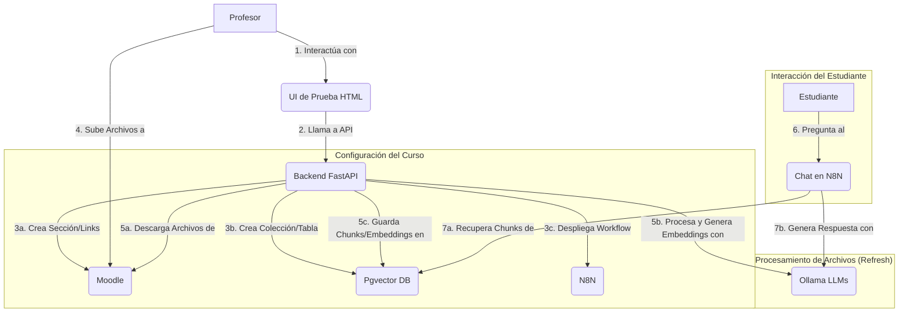

# Diseño del Proyecto - Entrenai

## 1. Introducción

Este documento detalla la arquitectura, las decisiones de diseño, la estructura de datos y los flujos de procesos del proyecto Entrenai. El objetivo de Entrenai es proporcionar un sistema de asistencia inteligente basado en IA para estudiantes dentro de cursos específicos de la plataforma Moodle, utilizando un enfoque de Generación Aumentada por Recuperación (RAG).

## 2. Objetivos del Proyecto

*   Permitir a los profesores configurar fácilmente una IA de asistencia para sus cursos de Moodle.
*   Procesar automáticamente el material del curso (documentos PDF, DOCX, PPTX, TXT, MD) para construir una base de conocimiento.
*   Ofrecer a los estudiantes una interfaz de chat para realizar preguntas sobre el contenido del curso y obtener respuestas relevantes y contextualizadas.
*   Utilizar modelos de lenguaje grandes (LLMs) auto-alojados para garantizar la privacidad y el control sobre los datos.
*   Proporcionar una solución modular y extensible.

## 3. Alcance

**Funcionalidades Cubiertas:**

*   Listado de cursos de Moodle para un profesor.
*   Configuración de la IA para un curso seleccionado (creación de sección y elementos en Moodle, colección/tabla en Pgvector, despliegue de workflow en N8N).
*   Procesamiento de archivos subidos a una carpeta específica en Moodle:
    *   Descarga de archivos nuevos/modificados.
    *   Extracción de texto de diversos formatos.
    *   Formateo del texto a Markdown.
    *   División del texto en chunks.
    *   Generación de embeddings para los chunks.
    *   Almacenamiento de chunks y embeddings en Pgvector.
*   Interfaz de chat (vía N8N) para que los estudiantes realicen preguntas y reciban respuestas basadas en el material del curso.

**Funcionalidades No Cubiertas (Posibles Mejoras Futuras):**

*   Interfaz de profesor avanzada para gestión de IA (más allá de la UI de prueba).
*   Soporte para tipos de archivo adicionales.
*   Mecanismos de feedback para las respuestas del chat.
*   Analíticas de uso.
*   Parametrización avanzada del workflow de N8N directamente desde la API.

## 4. Arquitectura del Sistema

El sistema Entrenai se compone de los siguientes módulos principales:

*   **Frontend (UI de Prueba):** Una interfaz web simple (HTML, CSS, JavaScript servida por FastAPI) que permite al profesor listar sus cursos de Moodle e iniciar el proceso de configuración de la IA para un curso seleccionado.
*   **Backend (FastAPI):** Es el cerebro del sistema. Expone una API REST que orquesta todas las operaciones, incluyendo la comunicación con Moodle, Pgvector, Ollama y N8N. Gestiona la lógica de negocio para la configuración de cursos y el pipeline de procesamiento de documentos.
*   **Moodle:** La plataforma LMS donde se alojan los cursos y los materiales. Entrenai interactúa con Moodle mediante sus Web Services para:
    *   Listar los cursos de un profesor.
    *   Crear una sección dedicada dentro de un curso.
    *   Crear una carpeta dentro de esa sección para que los profesores suban los documentos.
    *   Crear enlaces URL al chat de N8N y al endpoint de refresco de archivos.
    *   Listar y descargar archivos de la carpeta de documentos.
*   **Ollama:** Permite ejecutar modelos de lenguaje grandes (LLMs) de forma local. Entrenai lo utiliza para:
    *   Generar embeddings vectoriales a partir de los chunks de texto del material del curso.
    *   Formatear el texto extraído de los documentos a un formato Markdown limpio.
    *   (Utilizado por N8N) Generar respuestas a las preguntas de los estudiantes, utilizando el contexto recuperado de Pgvector.
*   **Pgvector (sobre PostgreSQL):** Una base de datos vectorial de alto rendimiento integrada en PostgreSQL. Se utiliza para almacenar los chunks de texto de los documentos del curso junto con sus correspondientes embeddings. Esto permite realizar búsquedas semánticas eficientes para encontrar la información más relevante a las preguntas de los estudiantes.
*   **N8N:** Una plataforma de automatización de workflows. Se utiliza para implementar la lógica del chatbot. Un workflow predefinido en N8N:
    *   Expone un webhook para recibir las preguntas de los estudiantes.
    *   Genera un embedding de la pregunta del estudiante (usando Ollama).
    *   Consulta a Pgvector con este embedding para encontrar los chunks de documentos más relevantes.
    *   Envía la pregunta original y los chunks recuperados a un LLM en Ollama para generar una respuesta contextualizada (RAG).
    *   Devuelve la respuesta al estudiante a través de la interfaz de chat.

### Diagrama de Arquitectura



## 5. Flujos de Datos y Procesos Principales

### 5.1. Configuración Inicial del Curso por el Profesor

1.  **Acceso a la UI:** El profesor accede a la interfaz web de Entrenai (`/ui/index.html`).
2.  **Listado de Cursos:** La UI llama al endpoint `GET /api/v1/courses` del backend FastAPI.
    *   FastAPI (usando `MoodleClient`) consulta a Moodle los cursos del profesor.
    *   La lista de cursos se muestra al profesor.
3.  **Selección y Creación de IA:** El profesor selecciona un curso y hace clic en "Crear IA para el curso".
    *   La UI llama al endpoint `POST /api/v1/courses/{course_id}/setup-ia`.
4.  **Orquestación del Backend (FastAPI):**
    *   **Pgvector:** Llama a `PgvectorWrapper.ensure_table()` (o método equivalente) para crear o verificar la existencia de la tabla y la extensión vectorial para el curso.
    *   **N8N:** Llama a `N8NClient.configure_and_deploy_chat_workflow()` para:
        *   Cargar una plantilla de workflow desde un archivo JSON.
        *   (Opcional) Parametrizar el workflow con el nombre de la tabla/colección Pgvector y configuraciones de Ollama.
        *   Importar y activar el workflow en la instancia de N8N.
        *   Obtener la URL del webhook del chat.
    *   **Moodle:** Llama a `MoodleClient` para:
        *   Crear una nueva sección en el curso (ej. "Recursos IA Entrenai").
        *   Dentro de esa sección, crear una carpeta (ej. "Documentos Entrenai") donde el profesor subirá los archivos.
        *   Crear un enlace URL al chat de N8N.
        *   Crear un enlace URL al endpoint `refresh-files` de la API de FastAPI.
5.  **Respuesta:** La API devuelve una confirmación al profesor con los detalles de la configuración.

### 5.2. Subida y Procesamiento de Archivos

1.  **Subida de Archivos:** El profesor sube los documentos del curso (PDF, DOCX, etc.) a la carpeta "Documentos Entrenai" creada en Moodle.
2.  **Activación del Refresco:** El profesor hace clic en el enlace "Refrescar Archivos" en Moodle (o se podría configurar un proceso periódico). Esto llama al endpoint `GET /api/v1/courses/{course_id}/refresh-files`.
3.  **Orquestación del Backend (FastAPI):**
    *   **Moodle:** `MoodleClient` obtiene la lista de archivos de la carpeta "Documentos Entrenai".
    *   **FileTracker:** Para cada archivo, `FileTracker` verifica si es nuevo o ha sido modificado desde el último procesamiento.
    *   **Descarga:** `MoodleClient` descarga los archivos nuevos/modificados a un directorio temporal.
    *   **Procesamiento por Archivo:**
        *   `FileProcessor`: Extrae el contenido textual del archivo (usando el procesador específico para su tipo: PDF, DOCX, etc.).
        *   `OllamaWrapper`: Formatea el texto extraído a Markdown limpio.
        *   `EmbeddingManager`:
            *   Divide el Markdown en chunks de tamaño y solapamiento configurables.
            *   (Opcional) Contextualiza cada chunk con metadatos (título del documento, nombre de archivo).
            *   Genera embeddings para cada chunk contextualizado usando `OllamaWrapper`.
        *   `PgvectorWrapper`: Inserta los chunks (texto original o contextualizado + embedding + metadatos) en la tabla Pgvector del curso.
        *   `FileTracker`: Marca el archivo como procesado con su timestamp de Moodle.
    *   **Limpieza:** Los archivos descargados localmente se eliminan.
4.  **Respuesta:** La API devuelve un resumen del proceso (cuántos archivos se revisaron, procesaron, etc.).

### 5.3. Interacción del Estudiante con el Chat

1.  **Acceso al Chat:** El estudiante hace clic en el enlace "Chat con Entrenai IA" en Moodle. Esto lo dirige al webhook de N8N.
2.  **Envío de Pregunta:** El estudiante escribe una pregunta en la interfaz de chat proporcionada por N8N.
3.  **Workflow de N8N:**
    *   El nodo Webhook Trigger recibe la pregunta.
    *   **Generación de Embedding de Pregunta:** (Opcional, pero recomendado) Un nodo llama a `OllamaWrapper` (directamente o vía API FastAPI) para generar un embedding de la pregunta del estudiante.
    *   **Búsqueda en Pgvector:** Un nodo consulta a `PgvectorWrapper` (directamente o vía API FastAPI, o usando un nodo PostgreSQL) con el embedding de la pregunta para encontrar los N chunks de documentos más relevantes de la tabla del curso.
    *   **Generación de Respuesta (RAG):**
        *   Se construye un prompt para un LLM (en Ollama) que incluye:
            *   Un mensaje de sistema (ej. "Responde la pregunta basándote únicamente en el siguiente contexto.").
            *   El contexto recuperado de Pgvector (los chunks relevantes).
            *   La pregunta original del estudiante.
        *   Un nodo llama a `OllamaWrapper` (directamente o vía API FastAPI) con este prompt.
    *   **Devolución de Respuesta:** El LLM genera una respuesta, y N8N la devuelve al estudiante a través de la interfaz de chat.

## 6. Estructura de Directorios

```
entrenai/
├── .env                # Variables de entorno locales (NO versionar)
├── .env.example        # Ejemplo de variables de entorno
├── docker-compose.yml  # Configuración de Docker Compose
├── Makefile            # Comandos útiles
├── requirements.txt    # Dependencias de Python
├── data/               # Datos generados (DB FileTracker, descargas, markdown temporal)
├── docs/               # Documentación (PROJECT_DESIGN.md, THESIS_REPORT.md)
├── src/
│   └── entrenai/
│       ├── api/        # Aplicación FastAPI: main.py, routers/
│       ├── core/       # Lógica principal: Clientes, Wrappers, Procesadores, Modelos Pydantic
│       ├── utils/      # Utilidades (ej. logger)
│       ├── config.py   # Clases de configuración
│       └── n8n_workflow.json # Plantilla del workflow de N8N para el chat
├── static/             # Archivos para la UI de prueba simple (HTML, CSS, JS)
├── tests/              # Pruebas Pytest (unitarias y de integración)
├── MEMORY_BANK.md      # Registro de progreso y decisiones
└── README.md           # Documentación principal
```

## 7. Clases y Módulos Principales

*   **`src/entrenai/config.py`:** Define clases Pydantic para cargar y gestionar la configuración de la aplicación desde variables de entorno (ej. `MoodleConfig`, `PgvectorConfig`, `OllamaConfig`, `N8NConfig`, `BaseConfig`).
*   **`src/entrenai/core/models.py`:** Contiene los modelos de datos Pydantic utilizados en toda la aplicación para representar entidades como cursos de Moodle, chunks de documentos, respuestas de API, etc.
*   **`src/entrenai/utils/logger.py`:** Configura el sistema de logging de la aplicación.
*   **`src/entrenai/core/moodle_client.py` (`MoodleClient`):** Encapsula la lógica para interactuar con la API de Web Services de Moodle. Responsable de obtener cursos, crear secciones, módulos (carpetas, URLs), listar archivos de carpetas y descargar archivos.
*   **`src/entrenai/core/n8n_client.py` (`N8NClient`):** Gestiona la interacción con la API de N8N. Responsable de importar, activar workflows y obtener información sobre ellos (como la URL del webhook del chat).
*   **`src/entrenai/core/pgvector_wrapper.py` (`PgvectorWrapper`):** Proporciona una interfaz para interactuar con la base de datos vectorial Pgvector (sobre PostgreSQL). Se encarga de crear/asegurar tablas y la extensión `vector`, insertar (upsert) puntos (chunks con embeddings) y realizar búsquedas semánticas.
*   **`src/entrenai/core/ollama_wrapper.py` (`OllamaWrapper`):** Envuelve la comunicación con el servicio Ollama. Responsable de generar embeddings, formatear texto a Markdown y generar completaciones de chat usando los LLMs configurados.
*   **`src/entrenai/core/file_processor.py` (`FileProcessor` y subclases):** Contiene la lógica para extraer texto de diferentes tipos de archivo (TXT, MD, PDF, DOCX, PPTX). Utiliza una clase base abstracta y procesadores específicos por extensión.
*   **`src/entrenai/core/embedding_manager.py` (`EmbeddingManager`):** Orquesta el proceso de preparación de texto para Pgvector: divide el texto en chunks, añade contexto, genera embeddings (usando `OllamaWrapper`) y prepara los objetos `DocumentChunk`.
*   **`src/entrenai/core/file_tracker.py` (`FileTracker`):** Utiliza una base de datos SQLite para rastrear qué archivos de Moodle ya han sido procesados y sus timestamps de modificación, para evitar reprocesamientos innecesarios.
*   **`src/entrenai/api/main.py`:** Punto de entrada de la aplicación FastAPI. Inicializa la app, configura middlewares (CORS), monta routers y archivos estáticos.
*   **`src/entrenai/api/routers/course_setup.py`:** Define los endpoints de la API relacionados con la configuración de cursos y el refresco de archivos. Utiliza los clientes y wrappers del `core` para realizar las operaciones.

## 8. Decisiones de Diseño Clave

*   **Enfoque RAG (Retrieval Augmented Generation):** Elegido para proporcionar respuestas basadas en el contenido específico del curso, mejorando la relevancia y reduciendo las alucinaciones en comparación con el uso directo de LLMs.
*   **FastAPI:** Seleccionado por su alto rendimiento, facilidad de uso, características modernas (tipado de Python, generación automática de documentación OpenAPI) y ecosistema robusto.
*   **Ollama para LLMs Locales:** Permite auto-alojar modelos de lenguaje, ofreciendo control sobre los modelos utilizados, privacidad de los datos (el contenido del curso no necesita salir a APIs externas) y potenciales ahorros de costos.
*   **Pgvector como Base de Datos Vectorial:** Elegido por su integración nativa con PostgreSQL, lo que simplifica la pila tecnológica si ya se usa PostgreSQL para otros fines, y por ser una solución robusta y de código abierto.
*   **N8N para el Workflow del Chat:** Proporciona una forma visual y flexible de construir la lógica del chatbot, permitiendo iteraciones rápidas y la integración de diferentes servicios (Pgvector, Ollama) sin necesidad de codificar toda la lógica del chat en el backend.
*   **Moodle Web Services + Plugin `local_wsmanagesections`:** La interacción con Moodle se basa en sus servicios web estándar y se complementa con un plugin para la gestión de secciones y módulos, lo que permite una integración más profunda.
*   **Modularidad:** El sistema está diseñado con componentes relativamente desacoplados (clientes, wrappers, procesadores), lo que facilita el mantenimiento, las pruebas y la posible sustitución de componentes en el futuro.
*   **Configuración Basada en Entorno:** El uso de archivos `.env` y clases de configuración permite adaptar la aplicación a diferentes entornos sin modificar el código.
*   **Idempotencia (parcial):** Se ha buscado que operaciones críticas como la creación de elementos en Moodle o la configuración de N8N sean idempotentes para permitir re-ejecuciones seguras.

## 9. Esquema de la Base de Datos (Pgvector)

*   **Tablas y Extensión:**
    *   Se utiliza la extensión `vector` de Pgvector en una base de datos PostgreSQL.
    *   Se crea (o asegura su existencia) una tabla principal para almacenar los embeddings, por ejemplo, `entrenai_embeddings`. Esta tabla puede ser única para toda la aplicación o específica por curso si se requiere un aislamiento más estricto (ej. `entrenai_course_{course_id}_embeddings`). La estrategia actual usa una única tabla con una columna `course_id`.
*   **Configuración de Vectores en la Tabla:**
    *   **Columna Vectorial:** Una columna de tipo `vector(DIMENSIONES)` almacena los embeddings. `DIMENSIONES` es determinado por el modelo de embedding utilizado (ej. 384 para `nomic-embed-text`). Configurable a través de `DEFAULT_VECTOR_SIZE`.
    *   **Métrica de Distancia:** Para búsquedas de similitud, se utiliza comúnmente la distancia Coseno (`<=>` operador en Pgvector para similitud, o `<->` para distancia).
    *   **Indexación:** Se pueden crear índices sobre la columna vectorial para acelerar las búsquedas. Pgvector soporta índices como IVFFlat y HNSW. Por ejemplo: `CREATE INDEX ON entrenai_embeddings USING ivfflat (embedding vector_cosine_ops) WITH (lists = 100);` o `CREATE INDEX ON entrenai_embeddings USING hnsw (embedding vector_cosine_ops);`.
*   **Puntos (Filas en la Tabla de Embeddings):**
    *   Cada fila en la tabla representa un `DocumentChunk` procesado.
    *   **ID del Punto (Clave Primaria):** Un UUID único (`id`) o un entero auto-incremental (`SERIAL`) para cada chunk.
    *   **Vector (`embedding`):** El embedding del chunk de texto (tipo `vector`).
    *   **Payload (Otras Columnas en la Tabla):** Almacenan información contextual sobre el chunk:
        *   `course_id` (int): ID del curso de Moodle.
        *   `document_id` (text): Identificador del documento original (ej. nombre del archivo en Moodle o un ID interno).
        *   `source_filename` (text): Nombre del archivo original.
        *   `document_title` (Optional[text]): Título del documento (si está disponible).
        *   `original_text` (text): El texto original del chunk.
        *   (Opcional) Otros metadatos como `page_number` (int) si se extraen durante el procesamiento.

## 10. Configuración de N8N

*   **Workflow:** Se utiliza un workflow de N8N (definido en `src/entrenai/n8n_workflow.json`) para manejar la lógica del chat.
*   **Trigger:** El workflow se inicia mediante un nodo Webhook Trigger, cuya URL se expone y se enlaza desde Moodle.
*   **Nodos Principales (Ejemplo):**
    1.  **Webhook Trigger:** Recibe la pregunta del usuario.
    2.  **(Opcional) Llamada a Ollama (Embedding Pregunta):** Un nodo HTTP Request (o un nodo específico de Ollama si existe) para generar el embedding de la pregunta del usuario.
    3.  **Llamada a Pgvector (Búsqueda de Chunks):** Un nodo PostgreSQL para ejecutar una consulta SQL que busca en la tabla de embeddings usando el embedding de la pregunta y la métrica de distancia apropiada (ej. `ORDER BY embedding <=> query_embedding LIMIT N`). Alternativamente, una llamada HTTP a un endpoint de la API FastAPI que encapsula esta lógica.
    4.  **Construcción de Prompt RAG:** Nodos para formatear el contexto recuperado y la pregunta original en un prompt para el LLM.
    5.  **Llamada a Ollama (Generación de Respuesta):** Un nodo HTTP Request (o nodo Ollama) para enviar el prompt RAG al LLM de QA y obtener la respuesta.
    6.  **Respuesta al Usuario:** El workflow devuelve la respuesta generada a la interfaz de chat.
*   **Credenciales en N8N:** El workflow puede requerir la configuración de credenciales dentro de N8N para interactuar con la base de datos PostgreSQL (donde reside Pgvector) y Ollama (si las llamadas se hacen directamente desde N8N). Estas credenciales se configuran en la UI de N8N.
*   **Parametrización:** El workflow está diseñado para ser relativamente genérico. La tabla Pgvector a consultar y los modelos Ollama a usar pueden estar configurados dentro de los nodos del workflow en N8N (posiblemente usando variables de entorno de N8N o valores fijos si el workflow es específico por curso tras la importación).

## 11. Variables de Entorno

Consulte el archivo `.env.example` para una lista completa de las variables de entorno requeridas y opcionales. Las más importantes incluyen:

*   **Generales:** `LOG_LEVEL`, `FASTAPI_HOST`, `FASTAPI_PORT`, `DATA_DIR`.
*   **Moodle:** `MOODLE_URL`, `MOODLE_TOKEN`, `MOODLE_DEFAULT_TEACHER_ID`, `MOODLE_COURSE_FOLDER_NAME`, etc.
*   **Pgvector (PostgreSQL):** `PGVECTOR_HOST`, `PGVECTOR_PORT`, `PGVECTOR_USER`, `PGVECTOR_PASSWORD`, `PGVECTOR_DB_NAME`, `PGVECTOR_TABLE_NAME` (ej. `entrenai_embeddings`), `DEFAULT_VECTOR_SIZE`.
*   **Ollama:** `OLLAMA_HOST`, `OLLAMA_EMBEDDING_MODEL`, `OLLAMA_MARKDOWN_MODEL`, `OLLAMA_QA_MODEL`.
*   **N8N:** `N8N_URL`, `N8N_WEBHOOK_URL` (URL base para los webhooks de N8N), `N8N_API_KEY`, `N8N_WORKFLOW_JSON_PATH`.
*   **Docker Compose (para `docker-compose.yml`):** `MOODLE_USERNAME`, `MOODLE_PASSWORD`, `MOODLE_DATABASE_USER`, `MOODLE_DATABASE_PASSWORD`, `MOODLE_DATABASE_NAME`, `POSTGRES_USER` (para Pgvector), `POSTGRES_PASSWORD` (para Pgvector), `POSTGRES_DB` (para Pgvector), `N8N_DATABASE_USER`, `N8N_DATABASE_PASSWORD`, `N8N_DATABASE_NAME`.
